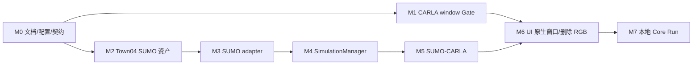

# TrafficVerse Agent Development Guide

> 版本：v1.3
> 状态：SUMO/CARLA Migration Baseline
> 计划：[SUMO_MIGRATION_PLAN](./SUMO_MIGRATION_PLAN.md)

## 1. 通用规则

每个任务开始前依次阅读 PRD、ADR、System Design、AGENTS 和本指南。所有实现遵守：

- SUMO/TraCI 是唯一交通真值，生产装配不得同时运行 Native Traffic Engine；
- SUMO GUI 不属于产品 UI，TrafficVerse 自己绘制全局二维页面；
- CARLA 是 ROI 三维镜像，其 windowed 原生窗口直接托管到 PySide6；
- 不实现或保留产品 `camera.frame`、UI RGB sensor、JPEG/base64 编解码链路；
- 只有 `SimulationManager` 推进 SUMO 和 CARLA；
- 先写 Fake/runtime contract 与失败测试，再写 adapter；
- 真实依赖未运行时不得宣称集成完成。

完成报告格式：

```text
Task: Mx
Status: COMPLETE | IMPLEMENTED / LIVE VALIDATION PENDING | BLOCKED
Changed files: ...
Public interfaces added/changed: ...
Commands run and results: ...
Acceptance criteria: ...
Known limitations: ...
```

## 2. 迁移依赖



M1 与 M2 可以并行；M1 必须在 CARLA、PySide6 和窗口处于同一图形桌面会话时验收。

## 3. M0 — 文档、配置与契约

允许修改：`docs/**`、`AGENTS.md`、`README.md`、`configs/**`、`.env.example`、`contracts/**`、
配置/领域/Port model 与契约测试。

验收：

- 活动约束不再声明 Native 为生产真值或 RGB 为三维产品路径；
- schema 1.2 包含 SUMO external endpoint、50 ms、`tls_manager=sumo` 和 native-window 配置；
- CARLA endpoint 为本机 2000；
- WebSocket 不提供 `camera.frame`；
- 配置示例、Pydantic schema 和生成物一致。

## 4. M1 — CARLA 原生窗口 Gate

允许修改：`ui/widgets/carla_native_window.py`、聚焦 UI 测试和验证报告。

实现 `attach/resize/focus/detach/close`，显式读取 native window ID。不得启动仿真或调用 CARLA
RPC。以下任一条件缺失时状态为 LIVE VALIDATION PENDING：图形桌面、PySide6、windowed CARLA、
有效 native window ID。

验收：同一桌面会话连续显示 10 分钟；resize/focus 正常；关闭 UI 后无悬挂 Qt 容器；无 RGB 数据。

## 5. M2 — Town04 SUMO 资产

允许修改：`scripts/maps/**`、`configs/maps/town04/**`、地图配置/校验测试。

由 CARLA 0.9.16 Town04 XODR 和 SUMO 1.27.1 生成：`.net.xml`、`.sumocfg`、`.rou.xml`、vtype、
GeoJSON、registration、signals 和 manifest。生成必须可重复，manifest 记录命令与 SHA-256。

验收命令：

```bash
python scripts/maps/generate_town04_sumo.py
sumo -c configs/maps/town04/map.sumocfg --end 5
```

## 6. M3 — SumoTrafficEngineAdapter

允许修改：`src/trafficverse/adapters/sumo/**`、Port 接线、Fake 与 unit/traffic integration tests。

必须覆盖版本握手、单 step、时间校验、车辆/路线/车道/运动标准化、departed/arrived、OpenDRIVE
signal ID、批量控制、部分控制拒绝、稳定错误与幂等 close。TraCI SDK 不得出现在其他包。

真实验收：

```bash
sumo -c configs/maps/town04/map.sumocfg --remote-port 8813
TRAFFICVERSE_SUMO_INTEGRATION=1 pytest -m traffic \
  tests/integration/traffic/test_sumo_adapter.py
```

## 7. M4 — SimulationManager 切换

允许修改：`application/simulation_manager.py`、`bootstrap.py`、生命周期测试和必要配置装配。

生产 factory 必须实例化 `SumoTrafficEngineAdapter`。顺序固定为 control -> SUMO step -> snapshot ->
ROI/signal -> CARLA batch -> CARLA tick -> publish。pause 不 step，SUMO 失败使实验 FAILED，关闭顺序
为 CARLA 后 SUMO。

## 8. M5 — SUMO 与 CARLA 联仿

允许修改：`roi/**`、`adapters/carla/**`、联仿装配与 integration tests。

复用 ROI 滞回和一一 binding；SUMO 坐标经集中 transformer 写入 CARLA；SUMO
`linkSignalID` 映射到 CARLA OpenDRIVE traffic-light ID；镜像车辆关闭 autopilot；只有 manager tick。

真实验收必须证明至少 10 actor、平面误差不超过 0.5 m、信号同 tick、stop 后 owned actor 为零并
恢复 world settings。

## 9. M6 — 自有二维 UI + CARLA 原生窗口

允许修改：`ui/**`、messaging/API schema、相应测试。

- 左侧 MapLibre/deck.gl 只处理 network/vehicle/TLS 协议，不嵌入 SUMO GUI；
- Web bundle 使用 Node.js 16.20.2、npm 8.19.4 构建并通过 lockfile 固定，运行时不访问 CDN；
- 右侧只使用 `CarlaNativeWindowHost`；
- 删除 `camera.frame` topic、UI decoder、camera widget 与 UI 专用 sensor 调用；
- 窗口失败显示明确恢复建议，不静默回退 RGB。

## 10. M7 — Core Run

在同一本机桌面会话启动：

1. `sumo -c ... --remote-port 8813`；
2. windowed CARLA 0.9.16 RPC 2000；
3. TrafficVerse API 8000；
4. PySide6 UI，并设置 `TRAFFICVERSE_CARLA_WINDOW_ID`。

验收 50 辆连续 2 分钟、至少 10 ROI actor、暂停时间冻结、控制先作用 SUMO、二维仅来自快照、
CARLA 原生窗口稳定、无 `camera.frame`、所有资源清理。Native/RGB 活动源码已经移除，M7 需要
确认它们未被重新引入；历史 ADR 继续保留。

## 10.1 M8 — 通用二维 SUMO 场景包

允许修改：`maps/sumo_package.py`、`maps/sumo_display.py`、`adapters/sumo/**`、运行装配、地图目录
API/UI、对应配置/契约/测试和 ADR-027 文档。

- 自动发现 `configs/maps/<package>/*.sumocfg`，不要求每包新增 TrafficVerse YAML；
- 安全解析 net/route/additional 等显式输入，越界或缺失只使对应包 invalid；
- managed 模式调用 PATH 中的 `sumo`，优先使用同发行版 TraCI tools，不硬编码版本等值；
- 场景 begin/end/step-length 进入内部 resolved snapshot，只有 manager 推进；
- 无 OpenDRIVE binding 的 TLS 使用 `sumo-tls:<tls-id>:<link-index>`；
- 桌面配置快照写入 `configs/configs/<timestamp>`，正式/测试运行副本与 outputs 分别只能写入
  `artifacts/simulations/<timestamp>` 和 `artifacts/tests/<timestamp>`；无快照的兼容 API 保留
  `artifacts/sumo/<experiment-id>`；
- CARLA disabled 时不得构造 ROI、registration 或 CARLA signal planner；
- 场景配置页只列出 `kind=sumo` 条目；Town04 Core Run manifest 只在资产中心和独立联仿 Gate
  中保留，不得作为二维场景 fallback；
- 不保留或恢复 `NativeTrafficEngine`、其路由器、专属配置 model 或对应测试。

真实验收：

```bash
TRAFFICVERSE_SUMO_PACKAGE_INTEGRATION=1 uv run pytest -m "integration and traffic" \
  tests/integration/traffic/test_managed_sumo_package.py
```

该测试必须报告实际 SUMO 版本；若本机无 SUMO，则标记 live validation pending，不能用 Fake 代替。

## 11. 合并门禁

- Ruff format/check、mypy、相关 unit/contract 通过；
- 新配置有 schema/default/example/cross validation；
- SUMO/CARLA SDK 不越界；
- 不提交运行 artifact、凭证或本机绝对路径；
- 外部测试按“已运行/未运行/环境阻塞”区分；
- 文档、代码和生成契约保持同一基线。
