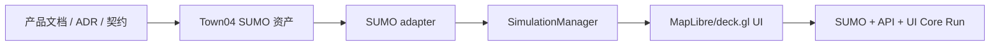

# TrafficVerse Agent Development Guide

> 版本：v1.3
>
> 状态：SUMO + TrafficVerse 2D Baseline
>
> 决策：[ADR-027](./ADR.md#adr-027--移除-carla产品聚焦-sumo--trafficverse-2d)

## 1. 通用规则

每个任务开始前依次阅读 PRD、ADR、System Design、AGENTS 和本指南：

- SUMO/TraCI 是唯一交通真值；
- SUMO GUI 不属于产品 UI，TrafficVerse 自己绘制二维页面；
- 只有 `SimulationManager` 推进 SUMO；
- UI 只消费 REST/WebSocket，不直接导入后端或 TraCI；
- CARLA、ROI、RGB 图像和 native-window 已移除，禁止保留或新增兼容路径；
- 先写 Fake/runtime contract 与失败测试，再写 adapter；
- 真实依赖未运行时不得宣称 integration/E2E 完成；
- 保留用户和其他任务的现有未提交改动。

完成报告格式：

```text
Task: ...
Status: COMPLETE | IMPLEMENTED / LIVE VALIDATION PENDING | BLOCKED
Changed files: ...
Public interfaces added/changed: ...
Commands run and results: ...
Acceptance criteria: ...
Known limitations: ...
```

## 2. 工作依赖



上游契约变化必须先同步 schema、配置和测试，再修改消费者。

## 3. 文档、配置与契约

允许范围由任务明确；不得顺带重写历史 ADR。当前基线要求：

- runtime/scenario schema 版本为 `2.0`；
- SUMO external endpoint 默认 `127.0.0.1:8813`；
- 固定步长 50 ms，`tls_manager=sumo`；
- WebSocket 只提供状态、指标、健康、生命周期、命令和错误；
- 配置示例、Pydantic model、OpenAPI/JSON Schema 和生成物一致；
- 已移除术语只能出现在历史 ADR、Obsolete 文档或明确禁止说明中。

## 4. Town04 SUMO 资产

允许修改：`scripts/maps/**`、`configs/maps/town04/**`、地图配置和校验测试。

由 Town04 OpenDRIVE 和 SUMO 1.27.1 生成 `.net.xml`、`.sumocfg`、`.rou.xml`、vtype、GeoJSON、
signals 和 manifest。生成可重复，manifest 记录命令和 SHA-256。

```bash
python scripts/maps/generate_town04_sumo.py
sumo -c configs/maps/town04/map.sumocfg --end 5
```

## 5. SumoTrafficEngineAdapter

允许修改：`src/trafficverse/adapters/sumo/**`、必要 Port 接线、Fake 与 unit/traffic integration tests。

必须覆盖版本握手、单 step、时间校验、车辆/路线/车道/运动标准化、departed/arrived、信号状态、
批量控制、部分控制拒绝、稳定错误和幂等 close。TraCI SDK 不得出现在其他包。

```bash
sumo -c configs/maps/town04/map.sumocfg --remote-port 8813
TRAFFICVERSE_SUMO_INTEGRATION=1 uv run pytest -m traffic \
  tests/integration/traffic/test_sumo_adapter.py
```

## 6. SimulationManager

允许修改：`application/simulation_manager.py`、`bootstrap.py`、生命周期测试和必要配置装配。

生产 factory 实例化 `SumoTrafficEngineAdapter`。顺序固定为：

```text
controls -> SUMO step -> immutable snapshot -> publish
```

pause 不 step；SUMO 失败使实验 FAILED；关闭顺序为停止命令、完成 tick、关闭 SUMO、flush 记录器、
发布最终状态。

## 7. MapLibre/deck.gl UI

允许修改：`ui/**`、必要 messaging/API schema 和对应测试。

- 页面只处理 network、vehicle、traffic-light、metric 和 health 协议；
- Web bundle 使用 Node.js 16.20.2、npm 8.19.4 构建，运行时不访问 CDN；
- 前端不按墙上时间推演车辆位置；
- 平面/倾斜视图共用同一 `WorldState`；
- sequence gap 请求完整 snapshot；
- 页面关闭时释放 WebGL、worker、bridge 和 Qt 资源；
- 软件 WebGL 参数只能在已验证环境显式启用。

## 8. Core Run

启动：

1. SUMO：`127.0.0.1:8813`；
2. TrafficVerse API：`127.0.0.1:8000`；
3. PySide6 UI。

验收 50 辆连续 2 分钟、暂停时间冻结、控制先作用 SUMO、二维状态仅来自快照、序列缺口恢复、
所有资源清理。历史迁移文档不能替代当前现场验收。

## 9. 合并门禁

- Ruff format/check、mypy、相关 unit/contract 通过；
- 新配置有 schema、default、example 和 cross validation；
- TraCI SDK 不越界；
- 默认 unit 不依赖真实网络、SUMO 或 GUI；
- 推荐 marker 仅为 `integration`、`traffic`、`postgres`、`e2e`、`performance`；
- 不提交运行 artifact、凭证、本机绝对路径或在线运行时依赖；
- 外部测试按“已运行/未运行/环境阻塞”区分；
- 文档、代码和生成契约保持同一产品基线。
