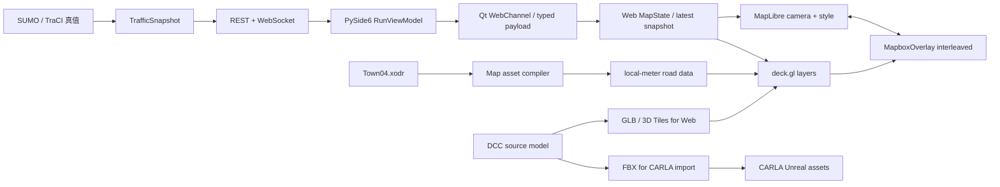

# MapLibre + deck.gl 二维/三维地图架构方案

> 状态：Accepted / implementation in progress
>
> 日期：2026-07-17
>
> 范围：PySide6 左侧 TrafficVerse 自有地图，不替代右侧 CARLA 原生窗口
>
> 决策入口：[ADR-026](./ADR.md#adr-026--左侧地图迁移到-maplibre--deckgl)

## 1. 结论

建议采用 `MapLibre GL JS + deck.gl`，但两者分工必须清楚：

- MapLibre 负责相机、缩放/旋转/倾斜、地图样式、背景和可选地理底图；
- deck.gl 负责 TrafficVerse 路网、车辆、信号灯、选中态、热力图和三维模型；
- 二维和三维共用同一份 `WorldState`，只切换相机参数与 deck.gl layer，不建立第二份状态；
- SUMO 仍是车辆和信号灯真值，前端不积分、不预测、不反向修改 CARLA；
- 右侧 `CarlaNativeWindowHost` 保持不变，左侧三维只是 WebGL 可视化，不是 CARLA 的替代品。

模型格式不能在 MapLibre/deck.gl 与 CARLA 之间统一成一个运行时文件：

| 用途 | 建议格式 | 原因 |
|---|---|---|
| 道路拓扑和坐标真值 | OpenDRIVE `.xodr` | SUMO/CARLA 同源地图的权威输入 |
| MapLibre 样式 | MapLibre Style JSON | 描述背景、图层顺序和可选底图 |
| deck.gl 小型/重复三维对象 | glTF 2.0 Binary `.glb` | `ScenegraphLayer` 可加载并实例化 glTF scenegraph |
| deck.gl 大型三维场景 | 3D Tiles `tileset.json` + GLB/B3DM | 按视口和 LOD 流式加载 |
| CARLA 自定义地图导入 | `.xodr` + `.fbx` + package JSON | CARLA 0.9.16 官方导入链要求 |
| CARLA 运行时 | Unreal cooked assets | 由 CARLA/Unreal 构建，不暴露给 Web 渲染器 |

可统一的是源资产和语义，而不是运行时容器：同一 DCC 源模型分别导出 FBX 给 CARLA、GLB 给
deck.gl，并通过共同的 `asset_id`、米制单位、坐标轴、pivot、LOD 和 checksum 清单建立绑定。

## 2. 为什么不让 MapLibre 直接渲染所有数据

MapLibre 的核心能力是 WebGL 地图和 style layer。它可以渲染 GeoJSON、矢量瓦片、地形、
`fill-extrusion`，也能通过 custom layer 接入三维引擎。但 TrafficVerse 的高频车辆和多种分析图层
更适合 deck.gl：

- deck.gl 的 layer 是 GPU 批量渲染抽象，避免为每辆车创建 DOM marker；
- 二维合成顺序固定为道路、车辆、信号灯；信号灯不设置最大像素半径，使灯芯在地图放大时保持
  可辨识并始终覆盖经过路口的车辆；
- `ScenegraphLayer` 可对同一 GLB 做多实例渲染；
- `MapboxOverlay` 同样支持 MapLibre，可选择 overlay 或共享 WebGL2 的 interleaved 模式；
- 以后可加入 `TripsLayer`、`HeatmapLayer`、`PolygonLayer` 和 `Tile3DLayer`，不用改变 MapLibre
  的地图生命周期。

目标采用 `MapboxOverlay({interleaved: true})`。三维车辆需要与道路、建筑和标签正确遮挡，
interleaved 比两个独立 canvas 更合适。其前置 Gate 是目标 Qt WebEngine 必须稳定提供 WebGL2。

## 3. 目标组件图



## 4. PySide6 / Qt WebEngine 兼容性与渲染风险

### 4.1 默认兼容策略

当前 UI 锁定 PySide6 6.11.1，Qt WebEngine 携带 Chromium 140.0.7339.225。MapLibre 与 deck.gl 都是
标准 WebGL Web 应用，第一版按 Chromium 正常能力实现，不增加浏览器品牌、GPU vendor、ANGLE、
texture limit 等预防性探测，也不维护大而全的兼容矩阵。

服务器构建环境固定为 Node.js 16.20.2、npm 8.19.4。Node/npm 只负责生成离线 Web bundle，不进入
产品运行时；依赖版本与 lockfile 必须能在该环境执行 `npm ci` 和 `npm run build`。

当前服务器 X11 `:1` 使用 Mesa `llvmpipe`，Chromium 140 默认把它列入 WebGL blocklist。真实加载测试
确认 `--ignore-gpu-blocklist --enable-unsafe-swiftshader --disable-gpu-compositing` 可使
MapLibre/deck.gl 正常显示。前两项允许软件 WebGL，第三项解决 WebGL 已 ready、但 Qt/Chromium
合成表面仍为全黑的问题。该覆盖通过 CLI 的 `--allow-software-webgl` 显式启用，只用于没有受支持
硬件 GPU 的服务器；普通桌面不默认添加兼容参数。

只保留一个真正的前置条件：deck.gl 与 MapLibre interleaved 模式需要 WebGL2。正常创建
MapLibre map 和 `MapboxOverlay` 即代表能力可用；初始化 API 返回错误时再显示失败信息，不额外重复
实现一套 capability probe。deck.gl 的 WebGPU 支持不进入本方案。

### 4.2 可能的渲染问题与处理原则

Qt WebEngine 通过 Chromium compositor 使用 GPU；CARLA 是另一个高负载 GPU 进程。两者并排时
可能出现以下问题：

- Qt 与 Chromium 在多 GPU 机器上选到不同设备，导致纹理导入失败或黑屏；
- ANGLE/OpenGL/Vulkan/Direct3D 组合与驱动不兼容；
- CARLA 占用大量显存后，WebGL context 被系统回收；
- Qt 窗口 resize、DPI 变化或显示器切换触发 canvas 重建；
- foreign CARLA native window 与 GPU-composited `QWebEngineView` 出现 z-order、裁剪或焦点问题；
- interleaved layer 的 GL state 未恢复，引起 MapLibre 标签、地形或 deck layer 闪烁。

第一版不为这些假设问题编写 doctor、自动 backend 切换、持续 GPU 采样或复杂恢复状态机。实现只需：

1. 使用 Qt WebEngine 默认 graphics backend，不主动传入 `--use-gl`；
2. 处理 MapLibre/deck 初始化失败和 GLB load error，这是正常异步 API 错误路径；
3. 页面关闭时调用 `overlay.finalize()` 和 `map.remove()`；
4. 在目标机器上同时运行 windowed CARLA 做一次人工 resize、DPI、焦点和 10 分钟稳定性 Gate。

只有真实复现黑屏、context loss 或 renderer crash 后，才按该问题增加最小监听与恢复代码。
`chrome://gpu`、Qt WebEngine 日志和 remote debugging 仅作为届时的排障工具，不进入正常启动路径。

### 4.3 本地资源与 worker

当前页面由 `QUrl.fromLocalFile()` 加载。Qt WebEngine 默认允许 local document 读取其他本地 URL，
但 MapLibre worker、GLB `fetch()`、严格 CSP 和打包后的路径会让 `file://` 方案变脆弱。

第一版继续沿用当前 `QUrl.fromLocalFile()` 和本地相对资源，直接验证 MapLibre worker 与
`box.glb` 能否加载。不要预先引入 `QWebEngineUrlSchemeHandler`、CSP 专用 worker bundle 或本地
HTTP server。只有打包环境真实出现 `file://`、CORS 或 worker 限制时，才选择其中一个最小修复。

Box GLB 只证明最小 glTF 2.0 core path。正式车辆模型首次引入纹理、压缩扩展或特殊材质时，为该
模型补针对性加载测试，不提前覆盖所有 glTF 扩展组合。

### 4.4 Qt bridge 吞吐与 UI thread

现有 `LeafletMapWidget` 使用 `runJavaScript()` 注入完整 JSON。第一版保持这个简单边界，每个 snapshot
一次调用，尚未发送时只保留最新完整状态。只有基准测试证明 500/2500 辆存在 IPC 或 JSON 瓶颈，
才考虑 typed payload/binary attributes。

当前实现需要：

- 不在 Qt UI thread 解析大型地图或 GLB；
- Qt bridge 只缓存一份 latest state；
- map 未 READY 时只缓存一份最新 network/state，不累计每个 tick；
- JS 渲染使用 `requestAnimationFrame`，只在 sequence 连续的两个已接收快照端点之间插值；
- 实时车辆使用2帧快照缓冲和统一仿真时间播放时钟，快照到达间隔只用于平滑估计播放倍率，不为
  每个快照单独启动一段动画；
- 不按速度积分、不越过最新快照外推，sequence gap 时取消动画并吸附到最新状态；
- 插值坐标只供 deck.gl 当帧绘制，不写回 `WorldState`、控制、指标或协议；
- 页面销毁时依次 `overlay.finalize()`、`map.remove()` 并移除自身事件监听。

### 4.5 像素密度、性能和 CARLA 资源竞争

Qt 6 对 WebEngine 启用 High DPI，CARLA 也会使用大量 GPU 资源。第一版采用几个直接影响成本的
简单约束：

- deck.gl `useDevicePixels: 1`，确认余量后再提高；
- 左侧三维只使用低模车辆和简化道路，不复制完整 CARLA Town04 场景；
- 非交互 layer 设置 `pickable: false`；
- 同车型共享一个 Scenegraph，禁止每车加载一次 GLB；
- 首阶段不加载完整 Town04 3D Tiles。

不在正常运行中持续采集 FPS、GPU backend、显存和 bridge 字节数。阶段 6 的一次性性能测试若发现
瓶颈，再为具体指标增加临时测量或必要的长期监控。

### 4.6 最小失败语义

MapLibre/deck 初始化失败时显示“地图渲染不可用”；Box/车辆 GLB 加载失败时保留二维车辆图层并显示
“三维模型加载失败”。第一版不细分 GPU、worker、CSP、driver 等错误码，因为在没有实际故障证据
时这些分类并不可靠。迁移期可以显式切回 Leaflet；任何地图失败都不改变 SUMO、CARLA 或实验真值。

## 5. 坐标系统设计

### 5.1 当前数据不能直接交给 MapLibre GeoJSON source

当前 `network.geojson` 保存 Town04/OpenDRIVE 局部米制坐标，例如 `[714.58, 731.63, 0]`。
Leaflet 通过 `CRS.Simple` 把它当作平面坐标。MapLibre 的地理相机和 GeoJSON source 按经纬度工作，
直接传入会把米值误当作 longitude/latitude。

禁止通过“交换 x/y”或把局部米值硬当经纬度来绕过。建议新增只属于展示层的
`web_registration.yaml`：

```yaml
schema_version: "1.0"
source_coordinate_system: OpenDRIVE
target_coordinate_system: deck-meter-offsets
anchor_wgs84:
  longitude_deg: 0.0
  latitude_deg: 0.0
  altitude_m: 0.0
source_origin_m:
  x: 0.0
  y: 0.0
  z: 0.0
axis_matrix:
  - [1.0, 0.0]
  - [0.0, 1.0]
heading_sign: 1
heading_offset_rad: 0.0
```

Town04 是虚构地图且默认不叠加真实地理底图，所以 anchor 可以是固定的非业务地理锚点。未来导入
真实地理地图时，anchor 必须来自资产编译结果，不允许 UI 猜测。

### 5.2 deck.gl 使用 meter-offsets

deck.gl 支持以 `[east_m, north_m, up_m]` 表达相对 WGS84 anchor 的 `meter-offsets`。因此动态车辆
无需每 tick 在 CPU 上转换成经纬度：

```javascript
const coordinateProps = {
  coordinateSystem: COORDINATE_SYSTEM.METER_OFFSETS,
  coordinateOrigin: [anchorLongitudeDeg, anchorLatitudeDeg, anchorAltitudeM],
  modelMatrix: trafficToEastNorthUpMatrix,
};
```

`modelMatrix` 承担局部轴翻转、旋转和平移。它必须由 `web_registration.yaml` 生成，并用与
`registration.yaml` 相同的控制点思想验证。CARLA 的 traffic-to-CARLA transform 不能被前端复用
为 Web transform，因为两者是不同消费边界。

### 5.3 静态路网的两种方案

MVP 采用方案 A：

- 方案 A：deck.gl `GeoJsonLayer`/`PathLayer` 读取局部米制路网，并应用同一 meter-offset transform；
- 方案 B：编译额外的 WGS84 GeoJSON/MVT，再交给 MapLibre style layer。

方案 A 不需要伪造 WGS84 GeoJSON，适合 Town04 和离线桌面应用。只有需要真实底图、地理查询、
服务端瓦片或 MapLibre label placement 时才进入方案 B。

### 5.4 离线 OpenStreetMap 的适用边界

Town04 的 OpenDRIVE header 只有约 `0..899 m × 0..801 m` 的局部范围，没有 `geoReference`。它是
虚构仿真城镇，不能与任意现实 OSM 区域对齐。因此当前版本不下载现实 OSM 瓦片作为 Town04 底图；
否则道路、信号和 SUMO/CARLA 车辆会系统性错位。

当前实现采用 OSM 风格的离线制图语言，但数据仍来自同一 Town04 资产：车道中心线派生 road casing、
road surface 和 lane guide，信号与车辆继续使用 meter-offset。未来导入包含有效地理配准的真实地图时，
可以在地图编译阶段下载对应 OSM PBF，裁剪后生成本地 MVT/PMTiles；产品运行时仍只读取本地资源，
不请求在线瓦片。

## 6. 二维与三维图层

### 6.1 二维模式

MapLibre camera：`pitch=0`、`bearing=0`。建议图层：

1. `GeoJsonLayer`/`PathLayer`：道路和车道中心线；
2. `ScatterplotLayer` 或 `IconLayer`：车辆；
3. `ScatterplotLayer`：信号灯；
4. `TextLayer`：选中车辆或调试标签；
5. 可选 `HeatmapLayer`：速度、拥堵和风险。

### 6.2 三维模式

MapLibre camera：`pitch=45..65`，允许 bearing。建议图层：

1. 道路仍使用 meter-offset layer，可增加宽度或低高度 polygon；
2. `ScenegraphLayer`：车辆 GLB，一种车型只加载一次模型并实例化；
3. `ScenegraphLayer` 或低模 geometry：交通灯；
4. `PolygonLayer`/MapLibre `fill-extrusion`：简化建筑；
5. `Tile3DLayer`：将来按 LOD 加载完整城市模型。

切换模式时只更新 camera 和 `layers` 数组。车辆选择、过滤、颜色、WebSocket sequence 和控制命令
保持同一套逻辑。

## 7. 三维资产目录与清单

建议目录：

```text
ui/
└── assets/
    └── models/
        ├── README.md
        ├── box.glb
        └── model-catalog.example.json
```

正式 catalog 建议包含：

```json
{
  "schema_version": "1.0",
  "models": [
    {
      "model_key": "debug.box",
      "web_uri": "box.glb",
      "format": "glb",
      "unit_scale_m": 1.0,
      "source_up_axis": "+Y",
      "source_forward_axis": "+Z",
      "orientation_calibration_deg": [0.0, 0.0, 0.0],
      "sha256": "ed52f7192b8311d700ac0ce80644e3852cd01537e4d62241b9acba023da3d54e"
    }
  ]
}
```

正式车辆模型还需 `carla_blueprint_id` 或独立 binding，但 CARLA adapter 不能读取 UI catalog。
推荐由地图/车型资产 manifest 同时引用两个派生物：

```text
asset_id: vehicle.sedan.default
source_asset: sedan.blend
web_model: sedan.glb
carla_import_mesh: sedan.fbx
```

GLB 与 FBX 必须分别记录 checksum、生成命令、许可证和导出器版本。不要从已打包 CARLA/Unreal
运行时逆向导出 Web 模型；Town04 是否允许分发派生 mesh 也必须先核对 CARLA 资产许可证。

## 8. deck.gl 加载样例

仓库内的 `ui/assets/models/box.glb` 来自 Khronos glTF Sample Assets，文件大小 1664 bytes，GLB
version 2，SHA-256 与上面的 catalog 一致。它只用于验证加载、坐标、缩放、旋转、光照和 picking，
不是车辆美术资产，也不能直接作为 CARLA FBX 输入。

概念性代码：

```javascript
const vehicleLayer = new ScenegraphLayer({
  id: "vehicles-3d",
  data: vehicles,
  scenegraph: "../../assets/models/box.glb",
  ...coordinateProps,
  getPosition: vehicle => [
    vehicle.position.x,
    vehicle.position.y,
    vehicle.position.z,
  ],
  getOrientation: vehicle => [
    0,
    headingToDeckYawDeg(vehicle.heading_rad),
    0,
  ],
  getScale: [4.5, 1.8, 1.5],
  pickable: true,
  _lighting: "pbr",
});
```

`headingToDeckYawDeg` 和 scale 不能长期硬编码；它们最终来自配准与 model catalog。样例的 Box 是
单位立方体，因此这里用近似轿车尺寸验证视觉效果。

## 9. 实现阶段与 Gate

### 阶段 0：架构决策（已完成）

- ADR-026 已接受并替代 ADR-017 的 Leaflet 选择；
- 确认左侧三维只是 TrafficVerse 可视化，右侧 CARLA 原生窗口继续满足产品三维验收；
- 以 Node.js 16.20.2、npm 8.19.4 冻结 MapLibre 5.x、deck.gl 9.x 的具体 patch 版本和 JS lockfile；
- 决定运行时完全离线，不依赖 CDN、token 或公网瓦片。

Gate：PRD、System Design、Agent Guide 和依赖边界同步后才能替换现有 Leaflet 文件。

### 阶段 1：WebGL2 与最小 PoC

- 在目标 PySide6/QWebEngine 环境加载本地 MapLibre；
- 使用空白 Style JSON，不接入在线底图；
- 加入 `MapboxOverlay({interleaved: true})`；
- 加载 `box.glb`，验证 resize、close 和无网络运行；
- WebGL2 不可用时显示明确错误，不静默回退成错误的三维状态。

Gate：连续运行 10 分钟，无 WebGL context loss，Box picking 和 resize 正常。

### 阶段 2：二维等价迁移

- 新建 `MapLibreDeckMapWidget`，保留窄 Qt WebChannel 边界；
- 用 deck.gl 路网、车辆、信号灯层替代 Leaflet marker；
- 保持现有 `setNetwork/setVehicles/setTrafficLights` 或一次性升级成命名 payload；
- 保持车辆点击、筛选、sequence gap 请求 snapshot 和错误提示；
- 为新 JS 层写单元测试和 PySide6 bridge 测试。

Gate：二维行为与当前 Leaflet 等价，插值端点与同 tick snapshot 一致，不存在自主推进车辆的前端
运动定时器，动画不会越过最新 snapshot。

### 阶段 3：坐标配准

- 定义并生成 `web_registration.yaml`；
- 使用至少三个非共线控制点验证 local-meter 到 deck east/north/up；
- 为位置、heading wrap、轴翻转、z、模型 pivot 建跨 Python/JavaScript fixture；
- 明确本地虚构 anchor 与未来真实地理 anchor 的切换条件。

Gate：Town04 选定控制点的 Web 可视化误差不超过 0.5 m。

### 阶段 4：三维车辆（实现中）

- 引入版本化 model catalog；
- 用 `ScenegraphLayer` 实例化车辆，先 Box、后低模 sedan；
- 对齐模型 forward/up axis、pivot、米制 scale 和 heading；
- 2D/3D toggle 只改变 camera/layers；
- 保持车辆控制仍通过 REST/WebSocket 回到 SUMO。

当前已引入 deck.gl 官方示例使用的 CC-BY-4.0 低模卡车并本地化为 `truck.gltf + truck.bin`，加入
`ScenegraphLayer`、PBR 光照、车辆聚焦以及 2D/3D 视角切换。正式车型 catalog、heading fixture、
50 辆/20 Hz 性能 Gate 仍待完成。

Gate：至少 50 辆在 20 Hz snapshot 下稳定渲染，选择 ID、位置和 heading 正确。

### 阶段 5：静态三维环境

- 先用道路 polygon 和 `fill-extrusion` 做低成本三维；
- 若需要完整 Town04 视觉模型，建立 DCC source -> FBX/GLB 双导出；
- 大场景转换为 3D Tiles 并建立 LOD、内存和许可 Gate；
- 不复制或反编译 CARLA cooked assets。

Gate：加载时间、显存、LOD 跳变和模型许可全部可审计。

### 阶段 6：性能与切换

- 测试 50/500/2500 车辆的 CPU、GPU、帧率、消息延迟和内存；
- WebSocket 消息可在 UI 边界合并到最新完整状态，但不得伪造中间权威位置；
- 仅在基准测试确认瓶颈后，引入 deck.gl update trigger 或 binary attribute；
- 通过回归后删除 Leaflet vendor 和 `LeafletMapWidget`，不长期维护双地图栈。

Gate：达成约定帧率和延迟后，更新 ADR-026 为 Accepted 并替代 ADR-017。

## 10. 推荐文件拆分

```text
ui/web/map/
├── index.html
├── src/
│   ├── app.ts
│   ├── bridge.ts
│   ├── maplibre_map.ts
│   ├── deck_layers.ts
│   ├── coordinate_transform.ts
│   └── state.ts
├── styles/
│   └── blank-style.json
└── bundle/                       # 离线构建输出，是否提交由打包流程决定

ui/widgets/
└── maplibre_deck_map.py

ui/assets/models/
├── README.md
├── box.glb
└── model-catalog.example.json
```

不要把 TypeScript 以内联字符串写进 Python。JS 依赖由 `package.json` 和唯一 lockfile 固定，运行时
不从 CDN 下载。若提交 `bundle/`，必须提供可重复构建命令和生成文件校验。

## 11. 风险与明确不做的事

- MapLibre 没有 Leaflet `CRS.Simple` 的直接等价物；必须使用 anchor + meter-offset 设计；
- 不能把当前局部米制 `network.geojson` 直接当 WGS84 GeoJSON；
- GLB 不能直接喂给 CARLA 0.9.16 地图导入，FBX 也不能直接喂给 deck.gl；
- 不把 CARLA Actor 状态作为左侧地图真值；
- 不通过左侧三维视图恢复 RGB/JPEG/WebSocket 相机链路；
- 不在首阶段引入在线地图 token、真实地理底图或第三方瓦片依赖；
- 不在没有模型许可证和 checksum 时提交 Town04 派生三维 mesh；
- 不在 ADR-026 接受前删除 Leaflet 实现。

## 12. 验收清单

- [x] ADR-026 被接受并同步 PRD/System Design/Agent Guide；
- [x] MapLibre/deck.gl 依赖有 lockfile、许可证信息和离线 bundle；
- [x] Qt WebEngine WebGL2 Gate 在服务器 X11 软件 WebGL 覆盖模式通过；
- [ ] 目标机器与 CARLA 并行运行时，resize、DPI、焦点和 10 分钟稳定性 Gate 通过；
- [x] 当前 `file://` 页面能加载 MapLibre/deck overlay；
- [ ] 当前 `file://` 页面能加载本地 GLB（进入三维阶段时验证）；
- [ ] 初始化或模型加载失败时有简洁、可执行的提示；
- [x] Box GLB 与低模卡车的 hash、来源和许可证可验证；
- [ ] `web_registration` 有控制点和误差测试；
- [ ] 二维与三维共用 `WorldState`；
- [ ] 车辆位置只来自同 tick SUMO snapshot；
- [ ] 2D/3D 切换不重连 WebSocket、不丢 selection；
- [ ] 车辆 picking 返回稳定 `vehicle_id`；
- [ ] sequence gap 会请求完整 snapshot；
- [ ] 关闭页面后 WebGL、worker 和 Qt 资源被释放；
- [ ] Leaflet 只在新实现通过回归后删除。

## 13. 官方参考

- [MapLibre GL JS 文档](https://maplibre.org/maplibre-gl-js/docs/)
- [MapLibre 使用 three.js 加载 3D 模型示例](https://maplibre.org/maplibre-gl-js/docs/examples/add-a-3d-model-using-threejs/)
- [deck.gl 与 MapLibre 集成](https://deck.gl/docs/developer-guide/base-maps/using-with-maplibre)
- [deck.gl coordinate systems](https://deck.gl/docs/developer-guide/coordinate-systems)
- [deck.gl ScenegraphLayer](https://deck.gl/docs/api-reference/mesh-layers/scenegraph-layer)
- [deck.gl Tile3DLayer](https://deck.gl/docs/api-reference/geo-layers/tile-3d-layer)
- [Khronos glTF 2.0 Registry](https://registry.khronos.org/glTF/)
- [Khronos glTF Sample Assets](https://github.com/KhronosGroup/glTF-Sample-Assets)
- [CARLA 0.9.16 map content authoring](https://carla.readthedocs.io/en/0.9.16/tuto_content_authoring_maps/)
- [CARLA 0.9.16 manual package preparation](https://carla.readthedocs.io/en/0.9.16/tuto_M_manual_map_package/)
- [Qt WebEngine hardware acceleration and WebGL](https://doc.qt.io/qt-6/qtwebengine-features.html)
- [Qt for Python QWebEngineSettings](https://doc.qt.io/qtforpython-6/PySide6/QtWebEngineCore/QWebEngineSettings.html)
- [Qt WebEngine custom URL schemes](https://doc.qt.io/qt-6/qwebengineurlscheme.html)
- [Qt WebEngine debugging and profiling](https://doc.qt.io/qt-6/qtwebengine-debugging.html)
- [deck.gl performance optimization](https://deck.gl/docs/developer-guide/performance)
