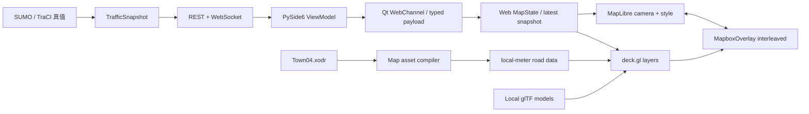

# MapLibre + deck.gl 二维地图架构

> 状态：Accepted / implementation in progress
>
> 日期：2026-07-30
>
> 范围：TrafficVerse 自有二维与倾斜 WebGL 地图
>
> 决策入口：[ADR-026](./ADR.md#adr-026--左侧地图迁移到-maplibre--deckgl)、
> [ADR-027](./ADR.md#adr-027--移除-carla产品聚焦-sumo--trafficverse-2d)

## 1. 结论

- MapLibre 负责相机、缩放、旋转、倾斜、地图样式和背景；
- deck.gl 负责路网、车辆、信号灯、选中态、热力图和 WebGL 模型；
- 平面和倾斜模式共用同一 `WorldState`，只切换相机与 layer；
- SUMO 是车辆和信号灯真值，前端不积分、不预测、不反向修改；
- 全部样式、bundle 和模型离线加载。

当前产品已移除 CARLA 和 native-window。文档中的“三维”仅表示 TrafficVerse 自有 WebGL 倾斜
视图，不表示外部仿真器或第二状态源。

## 2. 数据与模型格式

| 用途 | 格式 | 说明 |
|---|---|---|
| 道路拓扑输入 | OpenDRIVE `.xodr` | SUMO 网络生成的权威输入 |
| SUMO 运行资产 | `.net.xml`、`.sumocfg`、`.rou.xml` | 车辆推进与路线 |
| MapLibre 样式 | Style JSON | 背景和图层顺序 |
| 标准预览路网 | `network.geojson` | 展示专用，不参与推进 |
| 小型重复模型 | glTF 2.0 `.glb/.gltf` | deck.gl `ScenegraphLayer` |
| 大型 Web 场景 | 3D Tiles | 后续按 LOD 加载 |

模型必须记录 `asset_id`、米制单位、坐标轴、pivot、LOD、来源、许可证和 checksum。

## 3. 组件图



## 4. Qt WebEngine 与离线运行

UI 锁定 PySide6 6.11.1。构建环境固定 Node.js 16.20.2、npm 8.19.4；Node/npm 只生成离线 bundle，
不进入产品运行时。依赖由 lockfile 固定。

MapLibre 与 deck.gl interleaved 模式要求 WebGL2。初始化失败时显示“地图渲染不可用”，模型加载
失败时保留基础车辆图层并显示“模型加载失败”。普通桌面使用 Qt WebEngine 默认图形后端；仅在
已验证的软件渲染服务器显式使用 `--allow-software-webgl`。

页面当前由本地 URL 加载。只有打包环境真实出现 worker、CORS 或 CSP 限制时，才引入最小的
scheme handler 或本地服务方案。运行时不得从 CDN、GitHub 或公网瓦片下载资源。

## 5. Bridge 与资源生命周期

- Qt bridge 只缓存一份 latest state；
- map 未 READY 时只缓存最新 network/state，不累计 tick；
- JS 可用 `requestAnimationFrame` 绘制，但不得在帧间积分车辆位置；
- 不在 Qt UI thread 解析大型地图或模型；
- 页面关闭时调用 `overlay.finalize()`、`map.remove()` 并移除监听器；
- 高频快照的合并只能丢弃待渲染中间帧，不能伪造仿真状态。

## 6. 坐标系统

Town04 `network.geojson` 使用局部米制坐标，不能直接当 WGS84 经纬度。deck.gl 动态图层使用
`COORDINATE_SYSTEM.METER_OFFSETS` 和固定本地锚点：

```javascript
const coordinateProps = {
  coordinateSystem: COORDINATE_SYSTEM.METER_OFFSETS,
  coordinateOrigin: [anchorLongitudeDeg, anchorLatitudeDeg, anchorAltitudeM],
  modelMatrix: trafficToEastNorthUpMatrix,
};
```

`modelMatrix` 只承担展示坐标的轴翻转、旋转和平移。Town04 没有真实 `geoReference`，因此不叠加
现实 OSM 瓦片；采用由同一地图资产派生的 OSM 风格离线道路分层。

## 7. 图层

### 7.1 平面模式

1. `GeoJsonLayer`/`PathLayer`：道路和车道；
2. `ScatterplotLayer` 或 `IconLayer`：车辆；
3. `ScatterplotLayer`：信号灯；
4. `TextLayer`：选择和调试标签；
5. 可选 `HeatmapLayer`：速度或拥堵。

### 7.2 倾斜 WebGL 模式

1. 道路 polygon 或低高度 extrusion；
2. `ScenegraphLayer`：低模车辆；
3. 低模信号灯；
4. 简化建筑；
5. 后续可选 `Tile3DLayer`。

切换只更新 camera 和 layers。车辆选择、过滤、sequence 和控制命令保持不变。

## 8. 模型目录

```text
ui/assets/models/
├── README.md
├── box.glb
├── model-catalog.example.json
└── truck/
    ├── README.md
    ├── truck.gltf
    └── truck.bin
```

catalog 至少记录：

```json
{
  "schema_version": "1.0",
  "models": [
    {
      "model_key": "debug.box",
      "web_uri": "box.glb",
      "format": "glb",
      "unit_scale_m": 1.0,
      "source_up_axis": "+Y",
      "source_forward_axis": "+Z",
      "sha256": "ed52f7192b8311d700ac0ce80644e3852cd01537e4d62241b9acba023da3d54e"
    }
  ]
}
```

仓库模型只用于 TrafficVerse Web 地图，必须保留来源、许可证和 hash；运行时不得联网获取。

## 9. 实现阶段与 Gate

1. **基础 PoC**：离线 MapLibre、interleaved overlay、WebGL2、resize 和关闭；
2. **二维迁移**：路网、车辆、信号灯、选择、筛选和 sequence gap；
3. **展示坐标**：局部米制坐标、heading、轴与模型 pivot fixture；
4. **低模车辆**：catalog、共享模型实例、50 辆/20 Hz；
5. **静态环境**：道路 extrusion，必要时再评估 3D Tiles；
6. **性能**：按 50/500/2500 辆测量 CPU、GPU、帧率、延迟和内存；
7. **清理**：回归通过后删除 Leaflet，不长期维护双地图栈。

## 10. 验收清单

- [x] MapLibre/deck.gl 依赖有 lockfile、许可证和离线 bundle；
- [x] 软件 WebGL 覆盖模式完成已知服务器验证；
- [x] 页面可离线加载 MapLibre/deck.gl overlay；
- [x] Box 与低模卡车的 hash、来源和许可证可验证；
- [ ] 模型加载失败有可执行提示；
- [ ] 展示坐标有误差 fixture；
- [ ] 平面与倾斜模式共用 `WorldState`；
- [ ] 车辆位置只来自同 tick SUMO snapshot；
- [ ] 模式切换不重连 WebSocket、不丢 selection；
- [ ] picking 返回稳定 `vehicle_id`；
- [ ] sequence gap 请求完整 snapshot；
- [ ] 页面关闭后释放 WebGL、worker 和 Qt 资源；
- [ ] Leaflet 在新实现通过回归后删除。

## 11. 官方参考

- [MapLibre GL JS](https://maplibre.org/maplibre-gl-js/docs/)
- [deck.gl 与 MapLibre 集成](https://deck.gl/docs/developer-guide/base-maps/using-with-maplibre)
- [deck.gl coordinate systems](https://deck.gl/docs/developer-guide/coordinate-systems)
- [deck.gl ScenegraphLayer](https://deck.gl/docs/api-reference/mesh-layers/scenegraph-layer)
- [deck.gl performance](https://deck.gl/docs/developer-guide/performance)
- [Khronos glTF 2.0 Registry](https://registry.khronos.org/glTF/)
- [Qt WebEngine](https://doc.qt.io/qt-6/qtwebengine-features.html)
