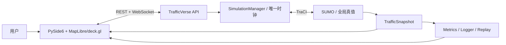

# TrafficVerse 产品需求文档（PRD）

> 版本：v1.5
>
> 状态：Current Product Baseline
>
> 日期：2026-07-30
>
> 决策基线：[ADR-027](./ADR.md#adr-027--移除-carla产品聚焦-sumo--trafficverse-2d)

## 1. 产品定义

TrafficVerse 是面向科研展示与教学演示的二维交通仿真平台。SUMO 是车辆、路线、车道、位置、
速度、加速度、信号灯和仿真时间的唯一真值源；TrafficVerse 提供 API、MapLibre/deck.gl 二维页面、
控制、指标、记录和回放。

系统必须遵循：

1. 车辆生成、移动、跟驰、换道、路线和信号灯均由 SUMO 驱动；
2. UI 只显示 TraCI 标准化状态，不自行积分或预测权威位置；
3. `SimulationManager` 是唯一仿真编排者，每个固定 tick 只调用一次 `simulationStep()`；
4. 产品不包装、嵌入或自动化 SUMO GUI；
5. 当前产品已移除 CARLA、ROI、RGB 图像和 native-window 能力，禁止以兼容模式恢复。

## 2. 用户与核心路径

目标用户是研究人员、交通算法开发者和教学演示用户。

1. 用户选择 Town04 场景；
2. 系统校验 OpenDRIVE、SUMO 路网、配置、路线和 GeoJSON；
3. 用户启动 SUMO TraCI、TrafficVerse API 和 UI；
4. TrafficVerse 连接 `127.0.0.1:8813` 并校验版本、地图和步长；
5. SUMO 按 50 ms 固定步长产生权威交通状态；
6. MapLibre/deck.gl 显示道路、全部车辆和信号灯；
7. 用户下发控制命令，命令在下一次 SUMO step 前通过 TraCI 应用；
8. 用户可暂停、恢复、停止，并查看指标和组件健康。

## 3. MVP 范围

### 3.1 地图资产

- 首个验收地图为 Town04；
- OpenDRIVE `.xodr` 上传会先编译并校验；只有同时生成 `.net.xml`、`.sumocfg`、route/vType
  且全部进入 manifest 的可运行 SUMO 包才允许发布到地图目录；
- 资产包含 `.xodr`、`.net.xml`、`.sumocfg`、route、vtype、`network.geojson`、
  `network.json`、`routes.yaml`、`signals.yaml` 和 `manifest.yaml`；
- `manifest.yaml` 记录来源、SUMO 版本、生成命令和 SHA-256；
- 展示资产不得参与车辆推进或成为第二真值；
- 路线或信号引用缺失、重复、歧义时拒绝 READY。

### 3.2 SUMO 全局交通仿真

- 通过 TraCI 连接外部 SUMO server，默认使用无界面 `sumo`；
- 固定步长为 50 ms；
- 每次 `simulationStep()` 后采集同一时刻的车辆、信号灯、departed 和 arrived 状态；
- 状态转换为不可变 `TrafficSnapshot`；
- 同一实例只允许 TrafficVerse 作为默认 TraCI client；
- 连接丢失、时间回退或 step 失败使实验进入 FAILED。

### 3.3 车辆控制

- `ControlCommand` 支持期望速度、期望加速度、左右换道、停车和恢复；
- 控制器只读取上一帧标准快照，不持有 TraCI connection；
- SUMO 对命令执行、运动和安全行为拥有最终裁决权；
- 单车命令失败返回稳定错误和 vehicle ID，不阻断同批其他合法命令。

### 3.4 MapLibre/deck.gl 二维可视化

- MapLibre 管理相机和地图样式，deck.gl 绘制本地米制路网、车辆和信号灯；
- 页面通过版本化 WebSocket snapshot/delta 更新；
- 页面不得使用墙上时间生成权威位置；
- 支持缩放、拖拽、车辆选择、筛选和控制命令；
- sequence gap 时请求完整 snapshot；
- 所有 bundle、模型和样式离线加载，不依赖 CDN、token 或公网瓦片。

### 3.5 地图资产目录

- 资产中心由 manifest 驱动，支持按名称、地图 ID、格式和文件名搜索；
- 预览只消费 REST 返回的摘要、manifest 和标准 `network.geojson`；
- 当前上传入口只接受 OpenDRIVE；通用 SUMO 生成链完成前，展示资产编译成功不得视为地图导入
  成功，也不得发布到可运行地图目录；
- OSM、Shapefile、Vissim 等多格式转换不进入 MVP。

### 3.6 生命周期、指标与记录

- 支持 prepare、start、pause、resume、stop；
- 支持 0.5×、1×、2×播放倍率，倍率不改变固定步长；
- 展示车辆数、平均速度、排队车辆数、仿真时间、tick 耗时和 SUMO 健康；
- stop/close 幂等并断开 TraCI；
- 支持结构化日志和最小轨迹记录。

### 3.7 明确不实现

- 第二交通真值源或自研交通流引擎与 SUMO 双引擎运行；
- SUMO GUI 嵌入或自动化；
- CARLA、ROI 同步、Actor、RGB/JPEG/base64/WebRTC/MJPEG 或 native-window；
- OSM、Shapefile、Vissim 直接导入；
- 行人、自行车、公共交通、复杂 OD 标定；
- 多机分布式仿真、生产级多租户和高保真三维回放。

## 4. 总体架构



### 4.1 真值权属

| 数据/能力 | 权威来源 | 消费者 |
|---|---|---|
| 车辆存在、路线、车道和运动 | SUMO | UI、指标、记录器 |
| 信号灯相位 | SUMO | UI、指标 |
| 仿真时间和 tick 顺序 | SimulationManager + SUMO step | UI、记录器 |
| 显示状态 | 标准化 `TrafficSnapshot` | MapLibre/deck.gl |
| 用户命令 | API 接收，SUMO 执行 | UI 不直接改状态 |

### 4.2 固定 tick 顺序

```text
读取并序列化控制命令
→ 通过 TraCI 向 SUMO 应用命令
→ simulationStep() 推进 50 ms
→ 采集车辆与信号灯状态
→ 生成同一 simulation_time_ms 的 TrafficSnapshot
→ 发布状态、指标和健康事件
```

暂停时不得调用 `simulationStep()`；UI、WebSocket callback 和日志线程无权推进仿真。

## 5. 运行基线

- Python 3.10；
- SUMO/TraCI 1.27.1，`127.0.0.1:8813`；
- TrafficVerse API，`127.0.0.1:8000`；
- PySide6 6.11.1；
- Node.js 16.20.2、npm 8.19.4 仅用于离线 Web bundle 构建；
- 固定仿真步长 50 ms。

```yaml
schema_version: "2.0"
simulation:
  step_ms: 50
traffic:
  provider: sumo
  launch_mode: external
  host: 127.0.0.1
  port: 8813
  step_ms: 50
  tls_manager: sumo
ui:
  api_url: http://127.0.0.1:8000
```

## 6. 验收标准

### 6.1 地图与环境

- manifest、checksum、路线和信号引用校验通过；
- doctor 检测到 SUMO/TraCI 与 `127.0.0.1:8813`；
- 产品运行不要求 GPU 仿真器、第三方三维运行时或外部窗口句柄。

### 6.2 交通与控制

- 固定 50 辆车连续运行 2 分钟，权威车辆状态全部来自 TraCI；
- UI 车辆 ID、位置、速度和灯色与同 tick 快照一致；
- UI 命令先改变 SUMO，再由下一帧快照更新页面；
- 暂停期间仿真时间不推进；
- SUMO 断线后实验进入 FAILED，不继续本地推演。

### 6.3 二维页面

- 显示路网、全部车辆和信号灯；
- 前端不存在权威车辆运动定时器；
- 2D/3D 相机切换只改变 TrafficVerse WebGL 展示，不改变状态来源；
- 车辆 picking 返回稳定 `vehicle_id`；
- sequence gap 请求完整 snapshot；
- 页面关闭后 WebGL、worker 和 Qt 资源被释放。

## 7. 参考资料

- [SUMO TraCI 文档](https://sumo.dlr.de/userdoc/TraCI/)
- [MapLibre GL JS](https://maplibre.org/maplibre-gl-js/docs/)
- [deck.gl](https://deck.gl/docs/)
