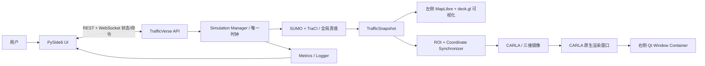

# TrafficVerse 产品需求文档（PRD）

> 版本：v1.5
>
> 状态：Target Baseline（实现迁移中）
>
> 日期：2026-07-17
>
> 目标：指导开发 Agent 完成“SUMO 全局交通真值 + PySide6 二维可视化 + CARLA 局部三维镜像”的可演示 MVP

## 1. 产品定义

TrafficVerse 是面向科研展示与教学演示的混合交通仿真平台。SUMO 负责全路网交通仿真，
是车辆、路线、车道、位置、速度、加速度、信号灯和仿真时间的唯一真值源；CARLA 负责
关注区域（ROI）内的三维视觉镜像；PySide6 桌面端负责操作、二维可视化、指标展示和托管
CARLA 原生渲染窗口。

系统必须遵循以下边界：

1. 车辆的生成、移动、跟驰、换道、路线和信号灯行为均由 SUMO 驱动；
2. PySide6 左侧二维地图只显示经 TraCI 标准化后的 SUMO 状态，不自行积分或预测车辆位置；
3. CARLA Actor 是 SUMO 车辆在 ROI 内的三维镜像，关闭 autopilot，不反向决定全局状态；
4. PySide6 右侧三维区域直接托管本机 CARLA 原生窗口，不通过 RGB 传感器、JPEG、base64、
   WebSocket `camera.frame` 或截图轮询传输画面；
5. `SimulationManager` 是唯一仿真编排者，每个固定 tick 只推进一次 SUMO 和一次 CARLA；
6. 产品基线使用同一台本机的 `127.0.0.1:8813` 连接 SUMO TraCI，使用
   `127.0.0.1:2000` 连接 CARLA RPC；CARLA 必须以可见窗口模式运行并处于与 PySide6 相同的
   图形桌面会话。

旧的 Native Traffic Engine 和 RGB 相机产品链路已经从活动实现中删除。所有二维运行都必须
通过 SUMO adapter 产生标准快照，不得重新引入第二交通真值。

## 2. 用户与核心场景

### 2.1 目标用户

- 需要演示交通流和局部自动驾驶行为的研究人员；
- 需要通过统一控制接口验证车辆策略的算法开发者；
- 需要同时观察二维全局交通和三维局部交通的教学用户。

### 2.2 核心用户路径

1. 用户搜索、创建或选择工作区，在工作区总览确认地图、场景、智能体和近期仿真摘要；
2. 用户进入工作区后，系统才展示“交通仿真”和“资产中心”两组控制中心导航；
3. 用户选择 Town04 场景；
4. 系统校验同源 OpenDRIVE、SUMO `.net.xml`、`.sumocfg`、route、信号灯映射和 GeoJSON；
5. 用户在本机启动 SUMO TraCI server、可见窗口模式的 CARLA 和 TrafficVerse；SUMO 可使用
   headless `sumo`，其 GUI 只允许作为独立调试工具，不属于 TrafficVerse 产品界面；
6. TrafficVerse 连接 SUMO TraCI `8813` 和 CARLA RPC `2000`，完成版本、地图和步长校验；
7. 用户启动实验，SUMO 按 50 ms 固定步长产生权威交通状态；
8. PySide6 左侧二维页面显示全部 SUMO 车辆、路网和信号灯；
9. ROI 内车辆和信号灯被同步到 CARLA，右侧嵌入的 CARLA 原生窗口显示三维场景；
10. 用户下发控制命令，命令在下一次 SUMO step 前通过 TraCI 应用；
11. 用户可暂停、恢复和停止实验，并查看车辆数、平均速度、排队长度和组件健康。

## 3. 产品范围

### 3.1 MVP 必须实现

#### Town04 地图资产

- 首个验收地图固定为 CARLA 0.9.16 Town04；
- SUMO 路网必须由同一 CARLA 发行版的 Town04 OpenDRIVE 生成；
- 使用 CARLA 官方 SUMO 联仿工具链的 `netconvert_carla.py` 生成 SUMO 网络，并启用
  `--guess-tls`；
- 资产至少包含 `.xodr`、`.net.xml`、`.sumocfg`、route、vtype、`network.geojson`、
  `registration.yaml`、`signals.yaml` 和 `manifest.yaml`；
- `manifest.yaml` 记录来源、CARLA/SUMO 版本、生成命令和 SHA-256；
- `traffic-network/1.0` 与 `network.geojson` 可以保留为展示和查找资产，但不参与车辆推进，
  不得成为第二份交通真值；
- 信号灯映射缺失、重复或歧义时拒绝 READY，不在运行时按距离猜测。

#### SUMO 全局交通仿真

- 通过 TraCI 连接已启动的 SUMO server，产品默认使用无界面 `sumo`；
- 使用 50 ms 固定仿真步长，SUMO `step-length`、CARLA `fixed_delta_seconds` 和
  TrafficVerse `step_ms` 必须一致；
- SUMO 负责车辆生成、路线、跟驰、换道、交通信号灯、到达和移除；
- 每次 `traci.simulationStep()` 后采集同一仿真时刻的车辆、信号灯、departed 和 arrived 状态，
  转换为不可变 `TrafficSnapshot`；
- SUMO 是交通信号灯主控，联仿配置固定 `tls_manager: sumo`；
- MVP 同一 SUMO 实例只允许 TrafficVerse 一个 TraCI client；如未来使用多 client，必须配置
  `--num-clients` 和 client order 并新增验收；
- SUMO 连接丢失、时间回退或 step 失败属于真值丢失，当前实验进入 FAILED。

#### 通用二维 SUMO 场景包

- 除 Town04 Core Run 外，系统支持自动发现 `configs/maps/<package>/*.sumocfg` 原生 SUMO 包；
- 能由主机 `sumo -c <scene>.sumocfg` 独立运行且依赖完整的场景，不要求额外提供 `.xodr`、
  CARLA 配准或 Town04 manifest；
- 项目托管启动 PATH 中的主机 SUMO，自动使用实际版本；仅在场景显式配置 `expected_version` 时
  执行严格版本拒绝；
- 纯二维场景使用 `.sumocfg` 自带 begin、end 和 step-length，步长必须可表示为整数毫秒；
- 从配置引用的同一 `.net.xml` 生成道路、路口和通用 TLS Point，车辆与灯色仍只来自 TraCI；
- 保存仿真配置时在 `configs/configs/<timestamp>/` 创建场景包快照，记录场景/地图元数据；
  智驾数量非空时按 L0–L5 数量生成精确车辆需求，并让全部生成车辆在场景起始时刻发车；为空时
  原样保留已有 `.rou.xml`，并在两种情况下都使仿真时长写入 `.sumocfg`；
- 正式运行在 `artifacts/simulations/<timestamp>/`、快速测试在 `artifacts/tests/<timestamp>/`
  创建隔离副本，输入和输出都留在对应 artifact 树，不修改场景源文件或复用历史 outputs；
- 单个损坏场景不得阻止其他场景被发现，但损坏场景必须给出缺失文件、非法路径或 XML 错误。
- 桌面端“仿真配置”只列出此类 `kind=sumo` 包；Town04 Core Run manifest 只保留在独立联仿与
  资产目录链路中，不得作为第二种二维运行实现混入场景选择器。

#### 车辆控制

- `ControlCommand` 至少支持期望速度、期望加速度、左/右换道、停车和恢复；
- 控制器只读取上一帧标准快照并输出意图，不直接持有 TraCI connection；
- `SimulationManager` 在下一次 `simulationStep()` 前将批量命令交给 SUMO adapter；
- SUMO 对命令执行、车辆运动和安全行为拥有最终裁决权；UI 不直接修改二维 marker 或 CARLA Actor；
- 单车命令失败必须返回稳定错误和 vehicle ID，不得阻断其他合法命令或产生本地伪状态。

#### PySide6 MapLibre/deck.gl 可视化

- 左侧使用 MapLibre GL JS 管理相机和地图样式，使用 deck.gl GPU layer 绘制本地米制路网；
- 显示道路、车道、路口、信号灯和全部 SUMO 车辆；
- 首个 Gate 实现二维模式；后续三维模式复用同一 `WorldState`，不建立第二份车辆状态；
- 车辆和信号灯只消费后端发布的版本化 WebSocket snapshot/delta；
- 权威位置始终取最新 SUMO 快照。前端不得按速度或墙上时间积分，也不得越过最新快照预测；
  可以使用 `requestAnimationFrame` 在 sequence 连续的相邻快照端点之间生成瞬时展示坐标，但该
  坐标不得写回 `WorldState`、控制、指标或协议；
- 实时地图保留2个已接收快照作为展示缓冲，并按 `simulation_time_ms` 的连续时间轴播放，避免消息
  到达抖动在相邻插值段之间形成停顿；
- 支持缩放、拖拽、点击车辆、筛选及将控制命令提交到 TrafficVerse API；
- sequence gap 时必须终止展示插值、立即吸附到最新状态并请求完整 snapshot，不能基于缺帧状态
  推演。
- 不包装、嵌入或自动化 SUMO GUI 窗口；二维道路、车辆和信号灯全部由 TrafficVerse 自有页面绘制。

#### 工作区控制中心与资产目录

- 控制中心按 Stitch `_5` 分成“交通仿真”和“资产中心”两个一级分组；
- “交通仿真”包含“仿真配置、历史仿真、交通场景”，“资产中心”包含“地图、智能体”；
- 除“仿真配置”外的四个入口支持展开子级且默认折叠；实时监控不作为常驻导航；
- 用户在“仿真配置”点击“开始仿真”，实验创建成功后自动进入实时监控并按
  `prepare → start` 状态机启动；
- 仿真配置页不提供“保存草稿”；“保存配置”生成可重现的场景快照；未保存或已修改的
  值在“开始仿真”前自动保存；
- 仿真配置页默认场景名称为“未命名场景”，场景描述和智驾数量配置默认为空；配置保存成功
  只显示不含本机路径的短提示，并自动消失；
- “开始仿真”旁提供“测试”，测试走相同配置生成和启动链路，但结果不进入正式仿真目录；
- “历史仿真”直接枚举 `artifacts/simulations/<timestamp>/` 的一级目录，并展示创建、准备、就绪、
  运行、暂停、停止、完成和失败状态；测试目录与兼容运行目录不得混入正式历史列表；
- 选择记录后进入只读结果页。运行摘要、聚合指标、趋势和道路分布必须分别来自该目录的
  `run.json`、`configuration.json` 和 SUMO summary/tripinfo/edgeData/queue 输出；道路底图必须解析
  此次运行副本引用的 `.net.xml`，不得使用手绘或其他地图的占位几何；
- 正式运行输出周期性完整快照和有序车辆/信号增量 Parquet。回放复用实时监控页面的地图与控制条，
  但只读取结构化记录，不启动或重跑 SUMO、CARLA 和控制器；旧记录缺少结构化数据时明确禁用回放；
- 结果页支持导出 ZIP，包含该次运行的原始 artifact、结构化回放文件以及由同一解析结果生成的
  summary、trend 和 road-result CSV；
- 旧数据分析工作台及其可编辑分析面板不属于当前产品导航；
- “地图”以 manifest 驱动的目录树展示地图包和完整文件后缀，并支持按名称、地图 ID、平台、格式
  和文件名搜索；
- 选择目录或文件后，右侧使用独立 MapLibre/deck.gl 实例展示该地图包的标准
  `network.geojson`，支持二维/三维相机模式；
- 资产目录是可复用 UI 组件，不访问后端文件系统，只消费 REST 返回的地图摘要、manifest 和标准路网；
- 当前直接导入源仍为 OpenDRIVE `.xodr`；SUMO、CARLA、deck.gl、MapLibre 相关文件可由 manifest
  收录，支持级别与转换边界见 [地图资产目录与支持格式](./MAP_ASSET_CATALOG.md)；
- 目录收录不扩大权威地图编译范围，OSM、Shapefile、Vissim 等多格式转换仍不进入 MVP。
- “智能体”通过工作区级 API 配置接入，保存 API 地址、模型 ID 和凭证环境变量名称，不保存
  API Key 等 secret。

#### SUMO 与 CARLA 联仿

- `SimulationManager` 是唯一 step/tick 发起者；
- CARLA 开启 synchronous mode，`fixed_delta_seconds=0.05`；
- 车辆进入核心 ROI 时创建 CARLA Actor，离开扩展 ROI 后销毁，中间 Buffer 保持映射；
- 维护 `sumo_vehicle_id ↔ carla_actor_id` 一一映射；
- 在 CARLA `world.tick()` 前批量写入 ROI 车辆 transform、灯光和 SUMO 信号灯状态；
- CARLA 车辆关闭 autopilot 和 Traffic Manager 控制，不将碰撞或物理运动反写 SUMO；
- 每 tick 校验时间单调性、Actor binding 和有限的坐标同步误差；
- 同步机制以 CARLA 官方 SUMO co-simulation 的地图转换、固定步长、车辆/信号同步方式为参考，
  但由 TrafficVerse `SimulationManager` 统一编排，不同时运行第二个同步脚本争用 TraCI/CARLA tick。

#### CARLA 原生窗口 Qt 集成

- CARLA 必须以可见窗口模式启动；`-RenderOffScreen` 和 no-rendering mode 不满足右侧视图验收；
- PySide6 通过受控的本机 native window ID 获取 CARLA 顶层窗口，使用
  `QWindow.fromWinId()` 包装，再通过 `QWidget.createWindowContainer()` 放入右侧布局；
- native window ID 必须通过显式配置或受测试的平台 locator 获得，正式运行不得依赖模糊窗口标题猜测；
- 右侧容器只负责窗口承载、大小调整、焦点和生命周期，不通过窗口直接控制仿真；
- 核心协议不发布 `camera.frame`，后端不创建用于 UI 的 RGB sensor，UI 不解码 JPEG/base64；
- CARLA、PySide6 和窗口必须位于同一主机、同一用户图形会话；远程无头 CARLA 不能直接嵌入本机 Qt；
- Qt 外部窗口嵌入具有平台相关性。macOS 当前环境必须先通过原型 Gate；若平台不支持，
  readiness 返回 `CARLA_WINDOW_EMBED_UNSUPPORTED`，不得静默回退 RGB 传输；
- 窗口销毁或句柄失效时，UI 显示可执行恢复建议并更新三维组件健康。

#### 生命周期与展示

- 支持工作区搜索、创建、重命名和删除；仿真实验必须归属于有效工作区；
- 未进入工作区时不展示仿真配置、运行、历史仿真和工作区资产入口；
- 工作区总览第一阶段使用版本化 mock 接口占位，接口稳定后替换为真实聚合查询；
- 支持 prepare、start、pause、resume、stop；
- 支持固定 0.5×、1×、2×播放倍率，但倍率不改变 50 ms 仿真步长；
- 展示车辆数、平均速度、排队车辆数、仿真时间、tick 耗时、SUMO/CARLA/窗口健康；
- stop/close 必须幂等，断开 TraCI、恢复 CARLA world settings，并销毁本系统创建的 Actor；
- 支持结构化日志和最小轨迹记录。

### 3.2 MVP 明确不实现

- 自研交通流引擎或 Native Traffic Engine 与 SUMO 双引擎运行；
- OSM、Shapefile、Vissim 等多格式地图导入；
- 动态交通分配、用户均衡、复杂 OD 标定和成熟交通模型二次实现；
- 行人、自行车、公共交通及复杂无保护路口博弈；
- CARLA 物理结果反向覆盖 SUMO；
- RGB/JPEG/base64/WebRTC/MJPEG 相机流作为右侧三维视图；
- 跨主机原生窗口嵌入、远程桌面窗口抓取或多 CARLA 窗口管理；
- 2,500 辆优化、多机分布式仿真、生产级多租户和高级三维回放。

## 4. 总体架构



### 4.1 真值权属

| 数据/能力 | 权威来源 | 非权威消费者 |
|---|---|---|
| 车辆存在、路线、车道和运动 | SUMO | PySide6、CARLA、记录器 |
| 信号灯相位和放行状态 | SUMO | PySide6、CARLA |
| 仿真时间和 tick 顺序 | SimulationManager + SUMO step | CARLA、UI、记录器 |
| ROI Actor 和三维视觉 | CARLA | Qt 原生窗口容器 |
| 左侧显示状态 | 标准化 TrafficSnapshot | MapLibre/deck.gl，不自行推演 |
| 用户命令 | API 接收，SUMO 执行 | UI 不直接改状态 |

### 4.2 固定 tick 顺序

```text
读取并序列化本 tick 控制命令
→ 通过 TraCI 向 SUMO 应用命令
→ traci.simulationStep() 推进 50 ms
→ 采集 departed / arrived / vehicle / traffic-light 状态
→ 生成同一 simulation_time_ms 的 TrafficSnapshot
→ 计算 ROI create / update / destroy 与坐标变换
→ 批量更新 CARLA Actor 和信号灯
→ CARLA world.tick()
→ 发布二维状态、指标和健康事件（不发布 RGB 帧）
```

暂停状态不得调用 `simulationStep()` 或 `world.tick()`；UI、WebSocket callback、CARLA callback 和
日志线程均无权推进仿真。

## 5. 核心模块

### 5.1 SUMO Asset Pipeline

输入：Town04 `.xodr`、route/vtype 和生成配置。

输出：`.net.xml`、`.sumocfg`、route、vtype、`network.geojson`、信号灯映射、配准和 manifest。

职责：调用受版本约束的 CARLA/SUMO 转换工具，执行 topology、route、TLS reference、坐标控制点
和 checksum 校验。运行时加载已校验资产，不临时重写网络。

### 5.2 SumoTrafficEngineAdapter

职责：通过 TraCI 连接外部 SUMO，完成握手、订阅、批量控制、单步推进、状态标准化、健康和关闭。

为降低现有框架迁移范围，保留技术中性的公共 Port：

```python
class TrafficEnginePort(Protocol):
    def load(self, config: SumoConfig) -> None: ...
    def apply_controls(self, commands: Mapping[str, ControlCommand]) -> None: ...
    def step(self, target_time_ms: int) -> TrafficSnapshot: ...
    def health(self) -> ComponentHealth: ...
    def close(self) -> None: ...
```

`SumoTrafficEngineAdapter` 是唯一生产实现；`TrafficSnapshot` 的数据来自 SUMO，不代表项目内置
交通模型。仓库不再维护自研交通引擎实现。

### 5.3 SimulationManager

- 持有唯一仿真时钟和生命周期状态机；
- 串行调用 SUMO step、状态采集、ROI reconcile、CARLA batch update 和 CARLA tick；
- 管理控制命令边界、故障策略、播放倍率和组件健康；
- 禁止 API handler、UI 或 adapter 自建推进循环。

### 5.4 ROI and CARLA Synchronizer

- 复用核心区 + Buffer 滞回；
- 使用集中 `CoordinateTransformer` 完成 SUMO 到 CARLA 的位置和 heading 转换；
- 同步车辆生命周期、transform、车辆灯光和 SUMO 主控的信号灯；
- CARLA Actor 失败不改变 SUMO 真值；Core Run 配置为 CARLA required 时使 readiness/实验失败。

### 5.5 Visualization and API

- REST 提供工作区 CRUD/搜索/总览、地图、manifest、场景、实验生命周期和命令；
- WebSocket 提供 `world.snapshot`、`vehicle.delta`、`traffic_light.delta`、指标和健康事件；
- 不提供 `camera.frame` 作为 MVP 三维视图协议；
- 左侧 MapLibre/deck.gl 消费 SUMO 派生状态，右侧 `CarlaNativeWindowHost` 承载原生窗口；
- UI 仍是 API 客户端，不直接调用 TraCI 或 CARLA RPC。

## 6. 固化的 Town04 Core Run 本地基线

### 6.1 固定端点

```yaml
schema_version: "1.2"
simulation:
  step_ms: 50
traffic:
  provider: sumo
  launch_mode: external
  host: 127.0.0.1
  port: 8813
  step_ms: 50
  tls_manager: sumo
  config_file: map.sumocfg
carla:
  mode: required
  endpoint_mode: local_server
  host: 127.0.0.1
  port: 2000
  timeout_s: 30.0
  step_ms: 50
  expected_version: "0.9.16"
  rendering: windowed
ui:
  api_url: http://127.0.0.1:8000
  carla_view:
    mode: native_window
    native_window_id_env: TRAFFICVERSE_CARLA_WINDOW_ID
```

本节只约束 Town04 + CARLA Core Run。原生二维 SUMO 包按 ADR-027 使用主机 SUMO 和场景自带
时间配置，但不得覆盖真值提供者、step 顺序或 `tls_manager: sumo`。

### 6.2 SUMO 启动

产品推荐使用无界面的 SUMO TraCI server：

```bash
sumo -c map.sumocfg --remote-port 8813
```

需要人工观察或调试 SUMO 时可以使用：

```bash
sumo-gui -c map.sumocfg --remote-port 8813
```

SUMO GUI 始终是独立调试窗口，不会嵌入 PySide6。避免等待 GUI 点击播放时使用：

```bash
sumo-gui -c map.sumocfg --remote-port 8813 --start
```

TrafficVerse 是该实例唯一 TraCI client。不得同时运行 CARLA 官方 `run_synchronization.py` 与
TrafficVerse 争用相同 `8813` 连接或 CARLA tick；官方脚本仅作为同步语义参考。

### 6.3 CARLA 启动约束

- RPC endpoint 固定 `127.0.0.1:2000`；
- CARLA 必须在与 PySide6 相同的本机图形会话中以可见窗口启动；
- 不得使用 `-RenderOffScreen`；当前若以 RenderOffScreen 运行，必须重启为 windowed 模式后才能
  验收右侧原生窗口；
- UI 启动前必须能获得有效 native window ID；句柄获取方式由平台 PoC 冻结。

## 7. MVP 验收标准

### 7.1 地图与环境

- Town04 同源资产 manifest、checksum、路线和严格信号映射全部通过；
- doctor 检测到 SUMO/TraCI、`127.0.0.1:8813`、CARLA 0.9.16/`127.0.0.1:2000`；
- SUMO、CARLA 和 TrafficVerse 的步长均为 50 ms；
- CARLA 可见窗口句柄可由 PySide6 包装并嵌入右侧容器。

### 7.2 交通与控制

- 固定 50 辆车连续运行 2 分钟，所有权威车辆状态均来自 TraCI；
- 二维车辆 ID、位置、速度和灯色与同 tick TraCI 快照一致；
- UI 命令先改变 SUMO 行为，再由下一帧快照更新 2D/CARLA；
- SUMO 红灯停车、绿灯放行、跟驰和至少一次安全换道可观察；
- 暂停期间 SUMO/CARLA simulation time 均不推进；
- SUMO 断线后实验进入 FAILED，不继续本地推演。

### 7.3 二维、联仿与原生窗口

- 左侧显示路网、全部 SUMO 车辆和信号灯，前端不存在自主推进车辆的运动定时器；展示插值必须
  止于最新快照，sequence gap 时立即停止；
- 至少 10 辆车进入 ROI 并在 CARLA 中创建、更新和销毁；
- CARLA 与同 tick SUMO 转换坐标的平面误差不超过 0.5 m；
- CARLA 信号灯与 SUMO 在同一 tick 一致；
- CARLA 原生画面嵌入 PySide6 右侧并随布局调整尺寸；
- 运行期间没有 `camera.frame` WebSocket 消息、UI RGB 解码或 UI 专用 CARLA RGB sensor；
- 原生窗口失效时显示明确健康状态和恢复建议，不伪造或冻结为“正常画面”。

## 8. 迁移与交付约束

本 PRD 定义目标产品，不表示现有实现已满足。代码迁移前必须依次完成：

1. 新 ADR 正式替代 Native Traffic Engine、远程 RGB 和旧运行环境决策；
2. 更新 System Design、Agent Development Guide、AGENTS.md、README、配置和协议；
3. 恢复 SUMO/TraCI adapter 与 Town04 SUMO 资产；
4. 将 `SimulationManager` 切换到 SUMO 权威步进；
5. 完成 SUMO↔CARLA 同步；
6. 在目标桌面平台验证 Qt 外部窗口嵌入，再通过原生窗口 Gate；
7. Native Traffic Engine 生产与源码路径已移除；本地真实 SUMO + CARLA Core Run 仍须单独完成
   现场验收，不能由二维 SUMO 包测试替代。

详细步骤、依赖和验收见 [SUMO_MIGRATION_PLAN.md](./SUMO_MIGRATION_PLAN.md)。迁移完成前，任何 Agent
不得宣称目标架构已经可运行。

## 9. 参考资料

- [CARLA 官方 SUMO 联仿](https://carla.readthedocs.io/en/latest/adv_sumo/)
- [SUMO TraCI 文档](https://sumo.dlr.de/userdoc/TraCI/)
- [Qt for Python QWindow.fromWinId](https://doc.qt.io/qtforpython-6/PySide6/QtGui/QWindow.html)
- [Qt for Python QWidget.createWindowContainer](https://doc.qt.io/qtforpython-6/PySide6/QtWidgets/QWidget.html)
- [CARLA rendering options](https://carla.readthedocs.io/en/0.9.12/adv_rendering_options/)
