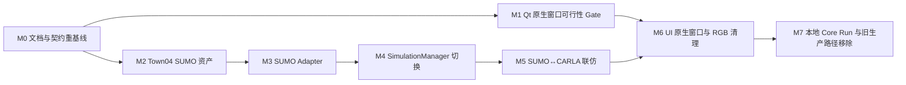

# SUMO + CARLA 架构迁移计划（Obsolete）

> 版本：v1.0
>
> 状态：**Obsolete — 已被 ADR-027 替代**
>
> 日期：2026-07-17
>
> 目标基线：[PRD v1.3](./PRD.md)
>
> 决策依据：[ADR-024 与 ADR-025](./ADR.md)

> [!IMPORTANT]
> 本文是历史迁移记录，不是当前产品计划、安装指南或验收依据。ADR-027 已移除 CARLA、ROI、
> RGB 图像和 native-window 产品能力；当前架构以 [PRD](./PRD.md) 和
> [System Design](./SYSTEM_DESIGN.md) 为准。以下历史正文为保留决策上下文，不应继续执行。

## 1. 迁移目标

将当前“Native Traffic Engine + WebSocket RGB 相机帧”的实现迁移为：

- SUMO/TraCI 是车辆和交通信号灯的唯一真值源；
- PySide6 左侧二维地图只可视化 SUMO 派生状态，不嵌入或控制 SUMO GUI；
- TrafficVerse 统一推进 SUMO 和 CARLA，并将 ROI 内 SUMO 状态镜像到 CARLA；
- PySide6 右侧直接托管本机 CARLA 原生窗口，不传输 RGB/JPEG/base64；
- 本地固定使用 SUMO `127.0.0.1:8813`、CARLA `127.0.0.1:2000` 和 API
  `127.0.0.1:8000`。

本文是修改计划，不表示所列代码已经实现。迁移期间必须始终只有一个生产真值源。

## 2. 当前实现与目标差异

| 领域 | 当前仓库基线 | 目标基线 | 影响 |
|---|---|---|---|
| 交通真值 | Native Traffic Engine | SUMO/TraCI | 架构级替换 |
| 地图运行资产 | `network.json`、`routes.yaml` | `.net.xml`、`.sumocfg`、`.rou.xml` | 恢复 SUMO 资产管线 |
| 公共 Port | 技术中性 `TrafficEnginePort` | 继续保留 | 下游改动最小化 |
| 生产 adapter | `NativeTrafficEngine` | `SumoTrafficEngineAdapter` | 新生产实现与生命周期 |
| 控制执行 | 自研行为/安全层 | TraCI 命令，SUMO 最终裁决 | 控制和错误语义调整 |
| 2D 车辆移动 | 原生快照 | TraCI 标准化快照 | UI 无需重写几何，只换生产者 |
| CARLA 同步 | Native snapshot → CARLA | SUMO snapshot → CARLA | ID、坐标、TLS 和 step 重验 |
| 右侧三维 | RGB sensor → JPEG/base64 → WebSocket | Qt 托管 CARLA 原生窗口 | 删除相机传输链路 |
| CARLA 部署 | 远程/RenderOffScreen 可用 | 本机、同桌面会话、windowed | 运行环境实质变化 |
| 故障策略 | Native 可离线运行 | SUMO 丢失即 FAILED | readiness/health 更新 |

## 3. 受影响文档评估

### 3.1 本轮已修改

| 文档 | 修改内容 | 状态 |
|---|---|---|
| `docs/PRD.md` | 冻结 SUMO 真值、二维只读、CARLA 联仿、Qt 原生窗口和本地端口 | 已完成 |
| `docs/ADR.md` | ADR-024 替代 Native 引擎；ADR-025 替代 RGB/远程窗口方案 | 已完成 |
| `docs/SUMO_MIGRATION_PLAN.md` | 记录差异、顺序、任务、风险和验收 | 已完成 |

### 3.2 开发前必须同步

| 文档/契约 | 必须修改的内容 | 完成条件 |
|---|---|---|
| `docs/SYSTEM_DESIGN.md` | 模块图、类图、时序图、TraCI 生命周期、SUMO↔CARLA 映射、Qt window host、错误与清理 | 与 ADR-024/025 无冲突 |
| `docs/AGENT_DEVELOPMENT_GUIDE.md` | 重新排序迁移任务，冻结每项输入、输出、依赖和 AC | Agent 不会继续实现 Native/RGB |
| `AGENTS.md` | 真值约束、目录规则、adapter 规范、Core Run 和测试规则 | 不再声明 Native 是真值 |
| `README.md` | 环境准备、三个服务启动顺序、`--start` 提示和常见错误 | 新用户可照文档连接本地服务 |
| `contracts/scenario.schema.json` | 增加 SUMO external endpoint、TLS manager、native window 配置，移除 Native-only 字段 | schema/model/示例一致 |
| `contracts/websocket/*` | 删除 Core Run `camera.frame`；核对 world/vehicle/TLS/health envelope | 契约测试锁定 |
| `contracts/openapi.yaml` | 同步场景配置、健康和错误码 | 由代码生成且 snapshot 通过 |
| `configs/runtime-baseline.yaml` | 固化版本、SUMO 8813、CARLA 2000、50 ms 和 windowed/native | doctor 能校验 |
| `configs/scenarios/core-run-town04.yaml` | 使用 `.sumocfg`、SUMO 真值、`tls_manager: sumo` | 可启动真实 Core Run |
| `.env.example` | 增加非敏感 host/port/native window ID 示例 | 不含本机绝对路径或凭证 |
| Town04 `manifest.yaml` | 同源 XODR、SUMO network/config/route/vtype/GeoJSON/checksum/生成命令 | map validate 通过 |

### 3.3 只保留历史、不直接改写

- ADR-022 的原始理由保留，通过 ADR-024 标为 Superseded；
- 旧 Native 引擎测试和资产在迁移完成前可作为回归参考，但不得出现在目标 Core Run；
- 旧 RGB 契约在消费者迁移前按明确顺序删除，不用空帧或兼容 hack 长期保留；
- 历史任务完成记录不得改写为新架构已验收。

## 4. 固化的运行配置

### 4.1 本地端点

| 组件 | Host | Port | 角色 |
|---|---:|---:|---|
| SUMO TraCI | `127.0.0.1` | `8813` | 全局交通真值和信号灯主控 |
| CARLA RPC | `127.0.0.1` | `2000` | ROI 三维镜像与原生渲染窗口 |
| TrafficVerse API | `127.0.0.1` | `8000` | UI 的 REST/WebSocket 入口 |

所有配置使用 `127.0.0.1` 作为稳定默认值；`localhost` 仅作为等价人工访问方式，不写入确定性
验收快照，避免 IPv4/IPv6 解析差异。

### 4.2 SUMO 命令

产品默认使用 headless SUMO TraCI server：

```bash
sumo -c map.sumocfg --remote-port 8813
```

需要独立调试 SUMO 时可使用：

```bash
sumo-gui -c map.sumocfg --remote-port 8813
```

SUMO GUI 不属于 TrafficVerse 页面；该调试模式需要在 GUI 点击播放。自动开始时使用：

```bash
sumo-gui -c map.sumocfg --remote-port 8813 --start
```

只有 TrafficVerse 可作为默认 TraCI client。官方 `run_synchronization.py` 用于理解和对照同步
机制，不与 TrafficVerse 同时推进相同 SUMO/CARLA 实例。

### 4.3 CARLA 窗口

- CARLA RPC 端口为 `2000`；
- 必须以 windowed 模式运行，不得带 `-RenderOffScreen`；
- CARLA 与 PySide6 必须在相同主机、相同用户、相同图形桌面会话；
- 优先通过环境变量 `TRAFFICVERSE_CARLA_WINDOW_ID` 显式传入 native window ID；
- 平台 locator 只能作为受测试的发现层，发现结果必须验证进程、窗口有效性和可嵌入性；
- Qt 使用 `QWindow.fromWinId()` 和 `QWidget.createWindowContainer()`；
- 若 macOS/Wine 的跨进程窗口句柄无法嵌入，阶段 M1 失败并停止后续窗口实现，不回退 RGB。

## 5. 分阶段实施计划



### M0 — 文档、配置与契约重基线

输入：PRD v1.3、ADR-024、ADR-025、当前 System Design/Agent Guide/AGENTS。

输出：同步后的 System Design、Agent Guide、AGENTS、README、配置 schema、WebSocket/OpenAPI 迁移顺序。

验收：全文检索不存在“Native Traffic Engine 是目标真值”或“右侧必须消费 RGB camera.frame”的
有效约束；历史 ADR 和迁移说明除外。

依赖：无。后续代码任务均依赖 M0。

### M1 — macOS Qt 原生 CARLA 窗口可行性 Gate

输入：已本地启动的 windowed CARLA、PySide6、CARLA 进程信息、native window ID。

输出：最小 `CarlaNativeWindowHost` 原型与平台验证报告；原型只做包装、嵌入、resize、focus、
detach/close，不接入业务状态。

验收：连续 10 分钟显示 CARLA 原生画面；窗口缩放可用；UI 关闭后无悬挂容器；CARLA 不因
reparent 崩溃；没有 RGB sensor、JPEG 或 WebSocket 图像数据。

依赖：M0。该 Gate 不通过时必须由用户决定平台或交互方案，不能擅自回退 RGB。

### M2 — Town04 SUMO 资产管线

输入：CARLA 0.9.16 Town04 OpenDRIVE、CARLA SUMO co-simulation 工具、SUMO 1.27.1。

输出：`.net.xml`、`.sumocfg`、`.rou.xml`、vtype、GeoJSON、registration、signals 和 manifest。

验收：网络/route/TLS reference/坐标控制点/checksum 校验通过；同输入重生成 hash 一致；
`sumo-gui -c map.sumocfg --remote-port 8813 --start` 可启动。

依赖：M0。

### M3 — SumoTrafficEngineAdapter

输入：现有 `TrafficEnginePort`、`TrafficSnapshot`、M2 资产、TraCI。

输出：外部连接配置、TraCI 生命周期、订阅、批量控制、fixed step、状态转换、health、close 和 Fake。

验收：

- 对 `127.0.0.1:8813` 连接和版本握手成功；
- 每次 `step(target_time_ms)` 恰好调用一次 `simulationStep()`；
- departed/arrived、车辆、路线/车道、速度/加速度和 TLS 被标准化；
- 无单独 adapter 自循环；SUMO 断连转换为稳定领域错误；
- unit、contract 和真实 `traffic` integration test 通过。

依赖：M0、M2。

### M4 — SimulationManager 切换 SUMO 真值

输入：M3 adapter、当前 SimulationManager、控制命令模型。

输出：SUMO-first tick 顺序、暂停/恢复、命令应用、snapshot 发布和故障策略。

验收：50 ms 顺序测试锁定；暂停不 step；控制结果先在 SUMO 生效再更新 UI/CARLA；二维生产路径
不调用 Native 引擎；SUMO 丢失使实验 FAILED。

依赖：M3。

### M5 — SUMO↔CARLA 联仿

输入：M4 SUMO snapshot、现有 ROI/坐标/CARLA adapter、官方 CARLA SUMO co-simulation 语义。

输出：车辆生命周期、位置/heading、车辆灯光、`tls_manager: sumo`、CARLA batch update/tick 和清理。

验收：至少 10 个 ROI Actor；误差不超过 0.5 m；信号同 tick 一致；只有 SimulationManager tick；
CARLA autopilot/Traffic Manager 不接管镜像车辆；stop 恢复 world settings 并清理 Actor。

依赖：M2、M4。

### M6 — PySide6 原生窗口集成与 RGB 链路移除

输入：M1 可行性结论、M5 联仿、现有 UI/API/WebSocket。

输出：正式 `CarlaNativeWindowHost`、native window 配置/health/error、删除 camera producer/consumer/contract。

验收：左侧只消费 SUMO 状态；右侧原生 CARLA 窗口可用；网络抓取中无 `camera.frame`；后端无
UI 专用 RGB sensor；旧 JPEG/base64 decoder 和测试被移除或改为历史迁移测试。

依赖：M1、M5。

### M7 — 本地 Core Run 与清理

输入：M2–M6、真实本地 SUMO `8813`、CARLA `2000`、PySide6。

输出：doctor、map validate、traffic smoke、co-simulation、UI E2E、Ruff、Mypy、pytest 证据；
Native 生产装配和旧 RGB 依赖移除。

验收：逐项满足 PRD 7；50 辆连续运行 2 分钟；start/pause/resume/stop 可用；无双真值；无外部资源
泄漏；失败项明确区分代码缺陷与环境阻塞。

依赖：M5、M6。

## 6. 关键风险与处理

### 6.1 RenderOffScreen 与原生窗口互斥

CARLA off-screen rendering 没有可供 Qt 托管的显示窗口。当前 CARLA 若使用 RenderOffScreen，
必须重启为 windowed，不能通过配置 UI 修复。

### 6.2 macOS/Wine 外部窗口嵌入不保证可用

Qt 明确说明 foreign window wrapping 是平台相关能力；`QWindow.fromWinId()` 可能返回空，
`createWindowContainer()` 也存在 stacking、focus 和性能限制。因此 M1 是阻断性 Gate，而不是优化项。

### 6.3 双重推进

不得同时让 TrafficVerse、CARLA 官方 `run_synchronization.py`、另一个 TraCI client 或 UI 推进
同一仿真实例。每 tick 的 SUMO step 和 CARLA tick 调用次数必须由测试和计数器验证。

### 6.4 地图与信号不一致

只允许使用同一 Town04 OpenDRIVE 派生的 CARLA/SUMO 资产；严格 TLS mapping 失败时不 READY。
不得用运行时最近邻匹配掩盖资产问题。

### 6.5 部分文档处于过渡状态

PRD 和 ADR 已切换为目标方向，但 System Design、Agent Guide 和 AGENTS 在 M0 完成前仍描述当前实现。
因此下一轮不能直接开始 SUMO 代码迁移，必须先完成 M0，防止后续 Agent 按冲突规则开发。

## 7. 推荐的下一步指令

```text
开始执行 docs/SUMO_MIGRATION_PLAN.md 的 M0：完整更新
docs/SYSTEM_DESIGN.md、docs/AGENT_DEVELOPMENT_GUIDE.md、AGENTS.md、README.md、
场景/运行配置设计与 REST/WebSocket 契约设计，使其与 PRD v1.3、ADR-024、ADR-025 一致。
本轮只修改设计、规范、配置示例与机器契约，不实现 SUMO/CARLA 代码；逐项报告所有被替代的
Native Traffic Engine 和 camera.frame 约束，并给出 M1 与 M2 的可执行验收命令。
```

M0 完成后，优先执行 M1，而不是直接大规模重写后端。原生窗口是当前新需求中平台风险最高、
最可能改变交付方案的部分，应最早得到真实结论。

## 8. 参考资料

- [CARLA 官方 SUMO 联仿](https://carla.readthedocs.io/en/latest/adv_sumo/)
- [SUMO TraCI](https://sumo.dlr.de/userdoc/TraCI/)
- [Qt QWindow.fromWinId](https://doc.qt.io/qtforpython-6/PySide6/QtGui/QWindow.html)
- [Qt QWidget.createWindowContainer](https://doc.qt.io/qtforpython-6/PySide6/QtWidgets/QWidget.html)
- [CARLA rendering options](https://carla.readthedocs.io/en/0.9.12/adv_rendering_options/)
