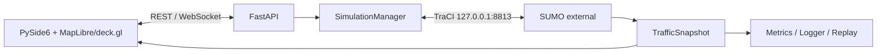

# TrafficVerse System Design

> 版本：v1.6
>
> 状态：Current Baseline
>
> 产品基线：[PRD](./PRD.md)
>
> 决策基线：[ADR-027](./ADR.md#adr-027--移除-carla产品聚焦-sumo--trafficverse-2d)

## 1. 系统边界与不可变原则

TrafficVerse 使用 SUMO 产生全局交通真值，使用自有 PySide6/MapLibre/deck.gl 页面显示状态：

- SUMO 只通过 TraCI 接入，不包装、嵌入或自动化 SUMO GUI；
- UI 只消费标准化 SUMO 快照；
- `SimulationManager` 是唯一 `traci.simulationStep()` 调用者；
- 固定步长为 50 ms，播放倍率只改变墙上时间调度；
- `network.json` 和 GeoJSON 只用于展示与查找，不参与车辆推进；
- CARLA、ROI 和 native-window 已由 ADR-027 移除，禁止保留兼容端口或运行时分支。

改变真值权属、唯一 step、固定步长或信号主控必须先新增 ADR。

## 2. 总体架构



依赖方向：

```text
ui -> REST/WebSocket contracts
api -> application -> ports -> domain
adapters/sumo -> ports + domain
maps -> domain
traffic/controllers -> ports + domain
bootstrap/cli -> application + concrete adapters
```

TraCI SDK 对象不得越过 SUMO adapter 边界。UI 不导入后端包，也不直接连接 TraCI。

## 3. 固定运行基线

| 组件 | 版本/端点 | 约束 |
|---|---|---|
| Python | 3.10 | 项目运行时 |
| Node.js | 16.20.2 | 仅 Web bundle 构建 |
| npm | 8.19.4 | JS lockfile 构建 |
| SUMO | 1.27.1 / `127.0.0.1:8813` | 外部 TraCI server |
| API | `127.0.0.1:8000` | loopback 默认 |
| UI | PySide6 6.11.1 | 离线 MapLibre/deck.gl |
| 步长 | 50 ms | SUMO 与 manager 一致 |

推荐启动：

```bash
sumo -c configs/maps/town04/map.sumocfg --remote-port 8813
uv run trafficverse serve --host 127.0.0.1 --port 8000
uv run trafficverse ui --api-url http://127.0.0.1:8000
```

`sumo-gui` 仅用于独立调试，不属于产品启动依赖。

## 4. 配置与资产

运行配置 schema 为 `2.0`：

```yaml
schema_version: "2.0"
simulation:
  step_ms: 50
traffic:
  provider: sumo
  launch_mode: external
  host: 127.0.0.1
  port: 8813
  step_ms: 50
  tls_manager: sumo
  config_file: configs/maps/town04/map.sumocfg
  expected_version: "1.27.1"
ui:
  api_url: http://127.0.0.1:8000
```

加载必须拒绝未知字段，并校验 step 一致、`tls_manager=sumo`、端口、版本、manifest、文件存在性
和 checksum。部署字段只允许通过明确环境变量覆盖，并写入 resolved snapshot。

Town04 manifest 追踪：

- `Town04.xodr`；
- `Town04.net.xml`、`map.sumocfg`、`Town04.rou.xml`、`vtypes.rou.xml`；
- `network.geojson`、`network.json`；
- `signals.yaml`、`routes.yaml`；
- SUMO 版本、生成命令和 SHA-256。

## 5. 领域模型

公共时间为整数 `simulation_time_ms`，每帧携带单调 `sequence`：

```text
TrafficSnapshot
  experiment_id
  simulation_time_ms
  sequence
  vehicles: tuple[VehicleState, ...]
  traffic_lights: tuple[TrafficLightState, ...]
```

`VehicleState` 使用稳定 SUMO vehicle ID，单位统一为米、秒和弧度。第三方 SDK 对象必须在 adapter
内转换为 TrafficVerse 模型。

## 6. SUMO Adapter

`SumoTrafficEngineAdapter` 是生产 `TrafficEnginePort` 实现：

1. 连接 TraCI server 并校验版本；
2. 在 step 前应用速度、加速度、停车和换道意图；
3. 每次 `step(target_time_ms)` 恰好调用一次 `simulationStep()`；
4. 校验 SUMO 时间与 target 一致；
5. 采集 vehicle、departed、arrived 和 traffic-light 状态；
6. 将 SDK 异常转换为稳定 `SUMO_*` 错误；
7. 幂等关闭 TraCI connection。

Adapter 没有自循环、线程或 wall-clock pacing。单车控制失败不阻断同批其他命令；连接或 step
失败属于真值丢失，实验进入 FAILED。

## 7. SimulationManager 与单 tick

```text
controller(previous snapshot)
-> merge queued API controls
-> SUMO apply_controls
-> SUMO simulationStep exactly once
-> immutable TrafficSnapshot
-> publish 2D state / health / metrics / events
```

暂停不调用 SUMO step。停止顺序为：停止接收新命令、完成当前 tick、关闭 SUMO、flush logger、
发布最终状态。重复 stop/close 必须安全。

## 8. 可视化

MapLibre 管理相机、交互和空白离线 style；deck.gl 使用 meter-offset layer 绘制局部米制
`network.geojson`、车辆和信号灯。页面通过 `world.snapshot`、`vehicle.delta` 和
`traffic_light.delta` 更新，不按墙上时间积分权威位置。

二维与倾斜 WebGL 模式共用同一 `WorldState`，模式切换只改变相机与 layer。sequence gap 时请求
完整 snapshot。页面关闭时释放 overlay、map、worker 和 Qt bridge 资源。

## 9. REST 与 WebSocket

REST 使用 `/api/v1`，提供地图、manifest、场景、实验生命周期和控制命令。

WebSocket 只传 TrafficVerse 业务状态：

- `world.snapshot`；
- `vehicle.delta`；
- `traffic_light.delta`；
- `component.health`；
- `experiment.state.changed`；
- command accepted/rejected、events 和 errors。

消息使用版本化 envelope，包含 `schema_version`、`type`、`experiment_id`、
`simulation_time_ms` 和 `sequence`。

## 10. 故障与安全

- SUMO 断连、时间回退或 step 失败使实验 FAILED；
- UI 客户端过慢时只断开该客户端，不阻塞仿真；
- 队列必须有界，状态可合并到最新快照，错误和状态变化不得静默丢弃；
- 日志不得包含凭证、完整环境变量、任意本机路径或大型轨迹帧；
- 地图路径必须限制在配置的资产根目录。

## 11. 测试与 Gate

| 层级 | 必须证明 |
|---|---|
| Unit | Fake TraCI 下单 step、转换、部分命令失败、时间错误和 close |
| Contract | Port、schema、协议版本、无 SDK 越界 |
| SUMO integration | 真实 1.27.1、Town04、时间单调、车辆和信号快照 |
| UI | 离线 bundle、snapshot 渲染、选择、sequence gap、资源释放 |
| Core E2E | SUMO/API/UI 的 create/start/pause/resume/stop |

推荐 marker：`integration`、`traffic`、`postgres`、`e2e`、`performance`。默认测试不得要求真实
SUMO、GUI、网络或 GPU；真实依赖测试必须显式选择并如实报告环境阻塞。
